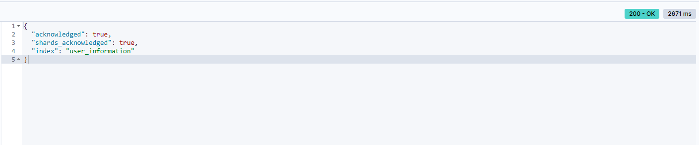
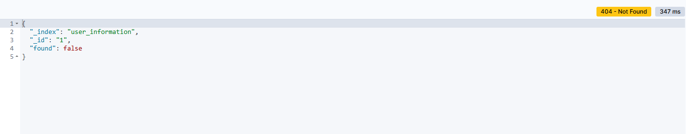
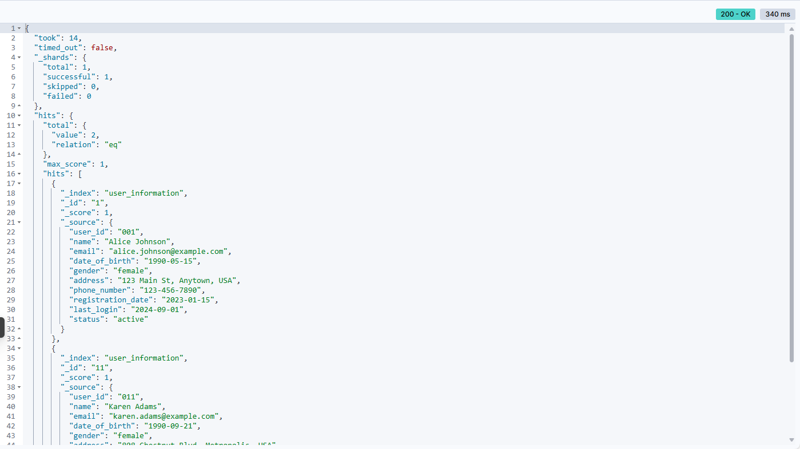

# 《实验二： 索引&文档操作》

>
>  **学院：  省级示范性软件学院**
>
> **题目：** 《实验二：索引操作与文档操作练习》
>
> **姓名：**  郭研棋
>
> **学号：**  2200770285
>
> **班级：**  软工2202
>
> **日期：**  2024-09-24
>
> **实验环境：**  Elasticsearch8.12.2以及Kibana8.12.2
> 

## 一、实验目的

1. 掌握Elasticsearch 安装IK分词器安装方法
2. 掌握Elasticsearch 索引操作方法
3. 掌握Elasticsearch 文档操作训练
4. 掌握Elasticsearch 高级查询与DSL训练

## 二、实验内容

### 1.IK分词器

使用IK分词器进行分词

```
POST _analyze
{
  "analyzer":"ik_smart",
  "text":"我是学生"
}
```

分词成功


### 2.索引操作练习

#### 2.1.创建索引

1. 创建用户信息 (User Information) 索引

   ```
   PUT /user_information
   {
     "mappings": {
       "properties": {
         "user_id": {
           "type": "keyword"
         },
         "name": {
           "type": "text",
           "analyzer": "standard"
         },
         "email": {
           "type": "keyword"
         },
         "date_of_birth": {
           "type": "date",
           "format": "yyyy-MM-dd"
         },
         "gender": {
           "type": "keyword"
         },
         "address": {
           "type": "text",
           "analyzer": "standard"
         },
         "phone_number": {
           "type": "keyword"
         },
         "registration_date": {
           "type": "date",
           "format": "yyyy-MM-dd"
         },
         "last_login": {
           "type": "date",
           "format": "yyyy-MM-dd"
         },
         "status": {
           "type": "keyword"
         }
       }
     }
   }
   ```

   插入成功

   

2. 创建产品目录 (Product Catalog) 索引

   ```
   PUT /product_catalog
   {
     "mappings": {
       "properties": {
         "product_id": {
           "type": "keyword"
         },
         "name": {
           "type": "text",
           "analyzer": "standard"
         },
         "description": {
           "type": "text",
           "analyzer": "standard"
         },
         "category": {
           "type": "keyword"
         },
         "price": {
           "type": "double"
         },
         "stock_quantity": {
           "type": "integer"
         },
         "supplier": {
           "type": "keyword"
         },
         "release_date": {
           "type": "date",
           "format": "yyyy-MM-dd"
         },
         "tags": {
           "type": "keyword"
         },
         "rating": {
           "type": "float"
         }
       }
     }
   }
   ```

   插入成功

   

3. 创建订单记录 (Order Records) 索引

   ```
   PUT /order_records
   {
     "mappings": {
       "properties": {
         "order_id": {
           "type": "keyword"
         },
         "customer_id": {
           "type": "keyword"
         },
         "order_date": {
           "type": "date",
           "format": "yyyy-MM-dd"
         },
         "status": {
           "type": "keyword"
         },
         "total_amount": {
           "type": "double"
         },
         "items": {
           "type": "nested",
             "properties": {
               "product_id": {
                 "type": "keyword"
               },
               "quantity": {
                 "type": "integer"
               },
               "price": {
                 "type": "double"
               }
           }
         },
         "shipping_address": {
           "type": "text",
           "analyzer": "standard"
         },
         "payment_method": {
           "type": "keyword"
         },
         "shipping_date": {
           "type": "date",
           "format": "yyyy-MM-dd"
         },
         "delivery_date": {
           "type": "date",
           "format": "yyyy-MM-dd"
         }
       }
     }
   }
   ```
   
   插入成功
   
   

#### 2.2.修改索引

1. 修改用户信息索引：添加用户身份证号，确定用户真实信息

   ```
   PUT /user_information/_mapping
   {
     "properties": {
       "identification_number":{
         "type": "keyword"
       }
     }
   }
   ```

   修改后进行查询

   

   修改成功

   

2. 修改产品目录索引：增加产品的重量信息，用于物流费用计算和仓储管理。

   ```
   PUT /product_catalog/_mapping
   {
     "properties": {
       "weight":{
         "type": "double"
       }
     }
   }
   ```

   修改后进行查询

   

   修改成功

   

3. 修改订单记录索引:客户在下单时留下的备注信息，例如特殊配送需求。

   ```
   PUT /order_records/_mapping
   {
     "properties": {
       "customer_notes":{
         "type": "text"
       }
     }
   }
   ```

   修改后进行查询

   

   修改成功

   

#### 2.3.删除索引

1. 删除用户信息索引

   ```
   DELETE /user_information
   ```

   删除后进行查询

   

   删除成功，查询失败

   

2. 删除产品目录索引

   ```
   DELETE /product_catalog
   ```

   删除后进行查询

   

   删除成功，查询失败

   

3. 删除订单记录索引

   ```
   DELETE /order_records
   ```

   删除后进行查询

   

   删除成功，查询失败

   

#### 2.4.查看索引

1. 查询用户信息索引

   ```
   GET /user_information
   ```

   查询成功

   

2. 查询产品目录索引

   ```
   GET /product_catalog
   ```

   查询成功

   

3. 查询订单记录索引

   ```
   GET /order_records
   ```

   查询成功

   


### 3.文档操作练习

#### 3.1.创建文档并将数据批量导入ES数据库中

1. 创建用户信息文档

   ```
   POST /user_information/_bulk
   {"index":{"_id":"1"}}
   {"user_id":"001","name":"Alice Johnson","email":"alice.johnson@example.com","date_of_birth":"1990-05-15","gender":"female","address":"123 Main St, Anytown, USA","phone_number":"123-456-7890","registration_date":"2023-01-15","last_login":"2024-09-01","status":"active"}
   {"index":{"_id":"2"}}
   {"user_id":"002","name":"Bob Smith","email":"bob.smith@example.com","date_of_birth":"1985-08-20","gender":"male","address":"456 Elm St, Othertown, USA","phone_number":"234-567-8901","registration_date":"2023-02-20","last_login":"2024-08-25","status":"active"}
   {"index":{"_id":"3"}}
   {"user_id":"003","name":"Charlie Brown","email":"charlie.brown@example.com","date_of_birth":"1992-11-30","gender":"male","address":"789 Maple Ave, Sometown, USA","phone_number":"345-678-9012","registration_date":"2023-03-10","last_login":"2024-09-05","status":"inactive"}
   {"index":{"_id":"4"}}
   {"user_id":"004","name":"David Wilson","email":"david.wilson@example.com","date_of_birth":"1988-02-14","gender":"male","address":"101 Oak St, Anycity, USA","phone_number":"456-789-0123","registration_date":"2023-04-05","last_login":"2024-08-30","status":"active"}
   {"index":{"_id":"5"}}
   {"user_id":"005","name":"Eve Davis","email":"eve.davis@example.com","date_of_birth":"1995-07-22","gender":"female","address":"202 Pine St, Otherville, USA","phone_number":"567-890-1234","registration_date":"2023-05-18","last_login":"2024-09-02","status":"active"}
   {"index":{"_id":"6"}}
   {"user_id":"006","name":"Frank Miller","email":"frank.miller@example.com","date_of_birth":"1991-10-05","gender":"male","address":"303 Cedar Rd, Newtown, USA","phone_number":"678-901-2345","registration_date":"2023-06-22","last_login":"2024-09-03","status":"active"}
   {"index":{"_id":"7"}}
   {"user_id":"007","name":"Grace Lee","email":"grace.lee@example.com","date_of_birth":"1989-04-17","gender":"female","address":"404 Birch Ln, Oldtown, USA","phone_number":"789-012-3456","registration_date":"2023-07-30","last_login":"2024-09-04","status":"inactive"}
   {"index":{"_id":"8"}}
   {"user_id":"008","name":"Hannah White","email":"hannah.white@example.com","date_of_birth":"1993-12-25","gender":"female","address":"505 Spruce St, Littletown, USA","phone_number":"890-123-4567","registration_date":"2023-08-15","last_login":"2024-09-06","status":"active"}
   {"index":{"_id":"9"}}
   {"user_id":"009","name":"Ivy Green","email":"ivy.green@example.com","date_of_birth":"1994-03-03","gender":"female","address":"606 Willow Ave, Bigcity, USA","phone_number":"901-234-5678","registration_date":"2023-09-01","last_login":"2024-09-07","status":"active"}
   {"index":{"_id":"10"}}
   {"user_id":"010","name":"Jack Black","email":"jack.black@example.com","date_of_birth":"1987-06-18","gender":"male","address":"707 Poplar Dr, Smalltown, USA","phone_number":"012-345-6789","registration_date":"2023-10-10","last_login":"2024-09-08","status":"inactive"}
   {"index":{"_id":"11"}}
   {"user_id":"011","name":"Karen Adams","email":"karen.adams@example.com","date_of_birth":"1990-09-21","gender":"female","address":"808 Chestnut Blvd, Metropolis, USA","phone_number":"123-456-7890","registration_date":"2023-11-25","last_login":"2024-09-09","status":"active"}
   {"index":{"_id":"12"}}
   {"user_id":"012","name":"Leo King","email":"leo.king@example.com","date_of_birth":"1986-01-12","gender":"male","address":"909 Ash Ct, Villagetown, USA","phone_number":"234-567-8901","registration_date":"2023-12-05","last_login":"2024-09-10","status":"active"}
   {"index":{"_id":"13"}}
   {"user_id":"013","name":"Mia Moore","email":"mia.moore@example.com","date_of_birth":"1992-02-28","gender":"female","address":"1010 Fir Ln, Hamlet, USA","phone_number":"345-678-9012","registration_date":"2024-01-10","last_login":"2024-09-11","status":"inactive"}
   {"index":{"_id":"14"}}
   {"user_id":"014","name":"Nina Scott","email":"nina.scott@example.com","date_of_birth":"1988-05-05","gender":"female","address":"1111 Cypress St, Township, USA","phone_number":"456-789-0123","registration_date":"2024-02-14","last_login":"2024-09-12","status":"active"}
   {"index":{"_id":"15"}}
   {"user_id":"015","name":"Oscar Turner","email":"oscar.turner@example.com","date_of_birth":"1991-07-19","gender":"male","address":"1212 Redwood Rd, Cityville, USA","phone_number":"567-890-1234","registration_date":"2024-03-20","last_login":"2024-09-13","status":"active"}
   {"index":{"_id":"16"}}
   {"user_id":"016","name":"Paul Walker","email":"paul.walker@example.com","date_of_birth":"1989-10-10","gender":"male","address":"1313 Cherry Ave, Urbantown, USA","phone_number":"678-901-2345","registration_date":"2024-04-25","last_login":"2024-09-14","status":"inactive"}
   {"index":{"_id":"17"}}
   {"user_id":"017","name":"Quinn Hughes","email":"quinn.hughes@example.com","date_of_birth":"1993-11-11","gender":"male","address":"1414 Beech St, Suburbia, USA","phone_number":"789-012-3456","registration_date":"2024-05-30","last_login":"2024-09-15","status":"active"}
   {"index":{"_id":"18"}}
   {"user_id":"018","name":"Rose Hall","email":"rose.hall@example.com","date_of_birth":"1990-03-22","gender":"female","address":"1515 Palm Dr, Downtown, USA","phone_number":"890-123-4567","registration_date":"2024-06-15","last_login":"2024-09-16","status":"active"}
   {"index":{"_id":"19"}}
   {"user_id":"019","name":"Steve Young","email":"steve.young@example.com","date_of_birth":"1987-09-09","gender":"male","address":"1616 Pine St, Uptown, USA","phone_number":"901-234-5678","registration_date":"2024-07-20","last_login":"2024-09-17","status":"inactive"}
   {"index":{"_id":"20"}}
   {"user_id":"020","name":"Tina Brown","email":"tina.brown@example.com","date_of_birth":"1994-12-12","gender":"female","address":"1717 Maple Ave, Seaside, USA","phone_number":"012-345-6789","registration_date":"2024-08-10","last_login":"2024-09-18","status":"active" }
   ```

   创建成功

   

2. 创建产品目录文档

   ```
   POST /product_catalog/_bulk
   {"index":{"_id":"1"}}
   {"product_id":"P001","name":"Wireless Mouse","description":"A high precision wireless mouse with ergonomic design.","category":"Electronics","price": 29.99,"stock_quantity": 150,"supplier":"TechCorp","release_date":"2023-01-15","tags": ["wireless", "mouse", "electronics"],"rating": 4.5}
   {"index":{"_id":"2"}}
   {"product_id":"P002","name":"Bluetooth Speaker","description":"Portable Bluetooth speaker with excellent sound quality.","category":"Audio","price": 49.99,"stock_quantity": 200,"supplier":"SoundWave","release_date":"2023-02-20","tags": ["bluetooth", "speaker", "audio"],"rating": 4.7}
   {"index":{"_id":"3"}}
   {"product_id":"P003","name":"Smartphone Stand","description":"Adjustable smartphone stand for hands-free viewing.","category":"Accessories","price": 15.99,"stock_quantity": 300,"supplier":"GadgetPlus","release_date":"2023-03-10","tags": ["smartphone", "stand", "accessories"],"rating": 4.3}
   {"index":{"_id":"4"}}
   {"product_id":"P004","name":"USB-C Charger","description":"Fast charging USB-C charger compatible with most devices.","category":"Chargers","price": 19.99,"stock_quantity": 250,"supplier":"ChargeMaster","release_date":"2023-04-05","tags": ["usb-c", "charger", "electronics"],"rating": 4.6}
   {"index":{"_id":"5"}}
   {"product_id":"P005","name":"Noise Cancelling Headphones","description":"Over-ear headphones with active noise cancellation.","category":"Audio","price": 89.99,"stock_quantity": 100,"supplier":"AudioTech","release_date":"2023-05-18","tags": ["noise cancelling", "headphones", "audio"],"rating": 4.8}
   {"index":{"_id":"6"}}
   {"product_id":"P006","name":"4K Monitor","description":"Ultra HD 4K monitor with stunning display quality.","category":"Monitors","price": 299.99,"stock_quantity": 80,"supplier":"ViewPerfect","release_date":"2023-06-22","tags": ["4k", "monitor", "electronics"],"rating": 4.9}
   {"index":{"_id":"7"}}
   {"product_id":"P007","name":"Gaming Keyboard","description":"Mechanical keyboard with customizable RGB lighting.","category":"Gaming","price": 59.99,"stock_quantity": 120,"supplier":"GameGear","release_date":"2023-07-30","tags": ["gaming", "keyboard", "electronics"],"rating": 4.4}
   {"index":{"_id":"8"}}
   {"product_id":"P008","name":"Fitness Tracker","description":"Smart fitness tracker with heart rate monitor.","category":"Wearables","price": 39.99,"stock_quantity": 180,"supplier":"FitLife","release_date":"2023-08-15","tags": ["fitness", "tracker", "wearables"],"rating": 4.2}
   {"index":{"_id":"9"}}
   {"product_id":"P009","name":"Electric Toothbrush","description":"Rechargeable electric toothbrush with multiple modes.","category":"Personal Care","price": 34.99,"stock_quantity": 140,"supplier":"SmileBright","release_date":"2023-09-01","tags": ["electric", "toothbrush", "personal care"],"rating": 4.5}
   {"index":{"_id":"10"}}
   {"product_id":"P010","name":"Smart Thermostat","description":"Wi-Fi enabled smart thermostat with energy saving features.","category":"Home Automation","price": 129.99,"stock_quantity": 90,"supplier":"HomeSmart","release_date":"2023-10-10","tags": ["smart", "thermostat", "home automation"],"rating": 4.7}
   {"index":{"_id":"11"}}
   {"product_id":"P011","name":"LED Desk Lamp","description":"Adjustable LED desk lamp with touch control.","category":"Lighting","price": 24.99,"stock_quantity": 160,"supplier":"BrightLight","release_date":"2023-11-25","tags": ["led", "desk lamp", "lighting"],"rating": 4.3}
   {"index":{"_id":"12"}}
   {"product_id":"P012","name":"Portable Hard Drive","description":"1TB portable hard drive with fast data transfer.","category":"Storage","price": 64.99,"stock_quantity": 110,"supplier":"DataSafe","release_date":"2023-12-05","tags": ["portable", "hard drive", "storage"],"rating": 4.6}
   {"index":{"_id":"13"}}
   {"product_id":"P013","name":"Coffee Maker","description":"Automatic coffee maker with programmable settings.","category":"Kitchen Appliances","price": 79.99,"stock_quantity": 130,"supplier":"BrewMaster","release_date":"2024-01-10","tags": ["coffee", "maker", "appliances"],"rating": 4.4}
   {"index":{"_id":"14"}}
   {"product_id":"P014","name":"Smart Light Bulb","description":"Color changing smart light bulb with app control.","category":"Lighting","price": 14.99,"stock_quantity": 220,"supplier":"LightSmart","release_date":"2024-02-14","tags": ["smart", "light bulb", "lighting"],"rating": 4.2}
   {"index":{"_id":"15"}}
   {"product_id":"P015","name":"Electric Kettle","description":"Quick boil electric kettle with auto shut-off.","category":"Kitchen Appliances","price": 29.99,"stock_quantity": 170,"supplier":"QuickBoil","release_date":"2024-03-20","tags": ["electric", "kettle", "appliances"],"rating": 4.5}
   {"index":{"_id":"16"}}
   {"product_id":"P016","name":"Robot Vacuum","description":"Smart robot vacuum cleaner with scheduling features.","category":"Home Appliances","price": 199.99,"stock_quantity": 60,"supplier":"CleanBot","release_date":"2024-04-25","tags": ["robot", "vacuum", "home appliances"],"rating": 4.8}
   {"index":{"_id":"17"}}
   {"product_id":"P017","name":"Digital Camera","description":"Compact digital camera with high resolution.","category":"Photography","price": 149.99,"stock_quantity": 95,"supplier":"PhotoSnap","release_date":"2024-05-30","tags": ["digital", "camera", "photography"],"rating": 4.7}
   {"index":{"_id":"18"}}
   {"product_id":"P018","name":"Smartwatch","description":"Feature-rich smartwatch with fitness tracking.","category":"Wearables","price": 99.99,"stock_quantity": 140,"supplier":"WristTech","release_date":"2024-06-15","tags": ["smartwatch", "wearables", "fitness"],"rating": 4.4}
   {"index":{"_id":"19"}}
   {"product_id":"P019","name":"Air Fryer","description":"Healthier cooking with a digital air fryer.","category":"Kitchen Appliances","price": 89.99,"stock_quantity": 115,"supplier":"HealthyCook","release_date":"2024-07-20","tags": ["air fryer", "kitchen", "appliances"],"rating": 4.6}
   {"index":{"_id":"20"}}
   {"product_id":"P020","name":"Electric Scooter","description":"Eco-friendly electric scooter with long battery life.","category":"Transportation","price": 299.99,"stock_quantity": 50,"supplier":"EcoRide","release_date":"2024-08-10","tags": ["electric", "scooter", "transportation"],"rating": 4.7}
   
   ```

   创建成功

   

3. 创建订单记录文档

   ```
   POST /order_records/_bulk
   {"index":{"_id":"1"}}
   { "order_id": "OR001", "customer_id": "C001", "order_date": "2024-01-10", "status": "completed", "total_amount": 150.75, "items": [{ "product_id": "P001", "quantity": 2, "price": 50.00 }, { "product_id": "P002", "quantity": 1, "price": 50.75 }], "shipping_address": "123 Main St, Anytown, USA", "payment_method": "credit_card", "shipping_date": "2024-01-11", "delivery_date": "2024-01-15" }
   {"index":{"_id":"2"}}
   { "order_id": "OR002", "customer_id": "C002", "order_date": "2024-01-15", "status": "pending", "total_amount": 89.99, "items": [{ "product_id": "P003", "quantity": 1, "price": 89.99 }], "shipping_address": "456 Elm St, Othertown, USA", "payment_method": "paypal", "shipping_date": "2024-01-16", "delivery_date": "2024-01-20" }
   {"index":{"_id":"3"}}
   { "order_id": "OR003", "customer_id": "C003", "order_date": "2024-01-20", "status": "shipped", "total_amount": 120.50, "items": [{ "product_id": "P004", "quantity": 3, "price": 40.00 }], "shipping_address": "789 Maple Ave, Sometown, USA", "payment_method": "debit_card", "shipping_date": "2024-01-21", "delivery_date": "2024-01-25" }
   {"index":{"_id":"4"}}
   { "order_id": "OR004", "customer_id": "C004", "order_date": "2024-01-25", "status": "completed", "total_amount": 75.00, "items": [{ "product_id": "P005", "quantity": 5, "price": 15.00 }], "shipping_address": "101 Oak St, Anycity, USA", "payment_method": "credit_card", "shipping_date": "2024-01-26", "delivery_date": "2024-01-30" }
   {"index":{"_id":"5"}}
   { "order_id": "OR005", "customer_id": "C005", "order_date": "2024-02-01", "status": "cancelled", "total_amount": 200.00, "items": [{ "product_id": "P006", "quantity": 2, "price": 100.00 }], "shipping_address": "202 Pine St, Otherville, USA", "payment_method": "bank_transfer", "shipping_date": "2024-02-02", "delivery_date": "2024-02-06" }
   {"index":{"_id":"6"}}
   { "order_id": "OR006", "customer_id": "C006", "order_date": "2024-02-05", "status": "completed", "total_amount": 300.25, "items": [{ "product_id": "P007", "quantity": 1, "price": 300.25 }], "shipping_address": "303 Cedar Rd, Newtown, USA", "payment_method": "credit_card", "shipping_date": "2024-02-06", "delivery_date": "2024-02-10" }
   {"index":{"_id":"7"}}
   { "order_id": "OR007", "customer_id": "C007", "order_date": "2024-02-10", "status": "pending", "total_amount": 45.99, "items": [{ "product_id": "P008", "quantity": 3, "price": 15.33 }], "shipping_address": "404 Birch Ln, Oldtown, USA", "payment_method": "paypal", "shipping_date": "2024-02-11", "delivery_date": "2024-02-15" }
   {"index":{"_id":"8"}}
   { "order_id": "OR008", "customer_id": "C008", "order_date": "2024-02-15", "status": "shipped", "total_amount": 89.50, "items": [{ "product_id": "P009", "quantity": 2, "price": 44.75 }], "shipping_address": "505 Spruce St, Littletown, USA", "payment_method": "debit_card", "shipping_date": "2024-02-16", "delivery_date": "2024-02-20" }
   {"index":{"_id":"9"}}
   { "order_id": "OR009", "customer_id": "C009", "order_date": "2024-02-20", "status": "completed", "total_amount": 60.00, "items": [{ "product_id": "P010", "quantity": 4, "price": 15.00 }], "shipping_address": "606 Willow Ave, Bigcity, USA", "payment_method": "credit_card", "shipping_date": "2024-02-21", "delivery_date": "2024-02-25" }
   {"index":{"_id":"10"}}
   { "order_id": "OR010", "customer_id": "C010", "order_date": "2024-02-25", "status": "cancelled", "total_amount": 150.00, "items": [{ "product_id": "P011", "quantity": 10, "price": 15.00 }], "shipping_address": "707 Poplar Dr, Smalltown, USA", "payment_method": "bank_transfer", "shipping_date": "2024-02-26", "delivery_date": "2024-03-01" }
   {"index":{"_id":"11"}}
   { "order_id": "OR011", "customer_id": "C011", "order_date": "2024-03-01", "status": "completed", "total_amount": 110.00, "items": [{ "product_id": "P012", "quantity": 2, "price": 55.00 }], "shipping_address": "808 Chestnut Blvd, Metropolis, USA", "payment_method": "credit_card", "shipping_date": "2024-03-02", "delivery_date": "2024-03-06" }
   {"index":{"_id":"12"}}
   { "order_id": "OR012", "customer_id": "C012", "order_date": "2024-03-05", "status": "pending", "total_amount": 75.99, "items": [{ "product_id": "P013", "quantity": 3, "price": 25.33 }], "shipping_address": "909 Ash Ct, Villagetown, USA", "payment_method": "paypal", "shipping_date": "2024-03-06", "delivery_date": "2024-03-10" }
   {"index":{"_id":"13"}}
   { "order_id": "OR013", "customer_id": "C013", "order_date": "2024-03-10", "status": "shipped", "total_amount": 200.00, "items": [{ "product_id": "P014", "quantity": 4, "price": 50.00 }], "shipping_address": "1010 Fir Ln, Hamlet, USA", "payment_method": "debit_card", "shipping_date": "2024-03-11", "delivery_date": "2024-03-15" }
   {"index":{"_id":"14"}}
   { "order_id": "OR014", "customer_id": "C014", "order_date": "2024-03-15", "status": "completed", "total_amount": 90.00, "items": [{ "product_id": "P015", "quantity": 6, "price": 15.00 }], "shipping_address": "1111 Cypress St, Township, USA", "payment_method": "credit_card", "shipping_date": "2024-03-16", "delivery_date": "2024-03-20" }
   {"index":{"_id":"15"}}
   { "order_id": "OR015", "customer_id": "C015", "order_date": "2024-03-20", "status": "cancelled", "total_amount": 135.00, "items": [{ "product_id": "P016", "quantity": 9, "price": 15.00 }], "shipping_address": "1212 Redwood Rd, Cityville, USA", "payment_method": "bank_transfer", "shipping_date": "2024-03-21", "delivery_date": "2024-03-25" }
   {"index":{"_id":"16"}}
   { "order_id": "OR016", "customer_id": "C016", "order_date": "2024-03-25", "status": "completed", "total_amount": 250.00, "items": [{ "product_id": "P017", "quantity": 5, "price": 50.00 }], "shipping_address": "1313 Cherry Ave, Urbantown, USA", "payment_method": "credit_card", "shipping_date": "2024-03-26", "delivery_date": "2024-03-30" }
   {"index":{"_id":"17"}}
   { "order_id": "OR017", "customer_id": "C017", "order_date": "2024-03-30", "status": "pending", "total_amount": 60.00, "items": [{ "product_id": "P018", "quantity": 2, "price": 30.00 }], "shipping_address": "1414 Beech St, Suburbia, USA", "payment_method": "paypal", "shipping_date": "2024-03-31", "delivery_date": "2024-04-04" }
   {"index":{"_id":"18"}}
   { "order_id": "OR018", "customer_id": "C018", "order_date": "2024-04-04", "status": "shipped", "total_amount": 100.00, "items": [{ "product_id": "P019", "quantity": 4, "price": 25.00 }], "shipping_address": "1515 Palm Dr, Downtown, USA", "payment_method": "debit_card", "shipping_date": "2024-04-05", "delivery_date": "2024-04-09" }
   {"index":{"_id":"19"}}
   { "order_id": "OR019", "customer_id": "C019", "order_date": "2024-04-09", "status": "completed", "total_amount": 180.00, "items": [{ "product_id": "P020", "quantity": 6, "price": 30.00 }], "shipping_address": "1616 Pine St, Uptown, USA", "payment_method": "credit_card", "shipping_date": "2024-04-10", "delivery_date": "2024-04-14" }
   {"index":{"_id":"20"}}
   { "order_id": "OR020", "customer_id": "C020", "order_date": "2024-04-14", "status": "cancelled", "total_amount": 220.00, "items": [{ "product_id": "P021", "quantity": 11, "price": 20.00 }], "shipping_address": "1717 Maple Ave, Seaside, USA", "payment_method": "bank_transfer", "shipping_date": "2024-04-15", "delivery_date": "2024-04-19" }
   ```

   创建成功

   

#### 3.2.修改文档

1. 修改文档中的部分内容

   ```
   POST /user_information/_update/1
   {
     "doc": {
       "name": "abc"
     }
   }
   ```

   修改成功

   

   再次查询

   

2. 修改文档中的全部内容

   ```
   PUT /user_information/_doc/1
   {
     "name": "Alice",
     "age": 31,
     "city": "New York"
   }
   ```

   修改成功

   

   再次查询

   

#### 3.3.删除文档

1. 删除指定ID的文档

   ```
   DELETE /user_information/_doc/1
   ```

   删除成功

   

   删除后查询，查询失败

   

2. 批量删除文档

   ```
   POST /product_catalog/_bulk
   {"delete":{"_id":"1"}}
   {"delete":{"_id":"2"}}
   {"delete":{"_id":"3"}}
   {"delete":{"_id":"4"}}
   {"delete":{"_id":"5"}}
   {"delete":{"_id":"6"}}
   {"delete":{"_id":"7"}}
   {"delete":{"_id":"8"}}
   {"delete":{"_id":"9"}}
   {"delete":{"_id":"10"}}
   {"delete":{"_id":"11"}}
   {"delete":{"_id":"12"}}
   {"delete":{"_id":"13"}}
   {"delete":{"_id":"14"}}
   {"delete":{"_id":"15"}}
   {"delete":{"_id":"16"}}
   {"delete":{"_id":"17"}}
   {"delete":{"_id":"18"}}
   {"delete":{"_id":"19"}}
   {"delete":{"_id":"20"}}
   ```

   删除成功

   

   删除后查询，查询失败

   

#### 3.4.查看文档

1. 查询读取user_information索引中ID为1的文档的全部信息

   ```
   GET /user_information/_doc/1
   ```

   查询成功

   

2. 查询user_information索引中ID为1的文档中的部分字段

   ```
   GET /user_information/_doc/1?_source=name
   ```

   查询成功

   

3. 批量查询

   ```
   GET /user_information/_mget
   {
     "ids": ["1", "2"]
   }
   ```

   查询成功

   

4. 同时查询ID为1和2的文档

   ```
   GET /_mget
   {
     "docs": [
       {
         "_index": "product_catalog",
         "_id": "1"
       },
       {
         "_index": "product_catalog",
         "_id": "2"
       }
     ]
   }
   ```

   查询成功

   


### 4.高级查询&DSL练习

#### 4.1. 用户信息数据查询

1. 查询所有女性用户的姓名和电子邮件。

   ```
   GET /user_information/_search
   {
     "query": {
       "match": {
         "gender": "male"
       }
     },
     "_source": ["name","email"],
     "size":20
   }
   ```

   查询成功部分截图

   

   查询成功代码

   ```
   {
     "took": 11,
     "timed_out": false,
     "_shards": {
       "total": 1,
       "successful": 1,
       "skipped": 0,
       "failed": 0
     },
     "hits": {
       "total": {
         "value": 10,
         "relation": "eq"
       },
       "max_score": 0.6931471,
       "hits": [
         {
           "_index": "user_information",
           "_id": "2",
           "_score": 0.6931471,
           "_source": {
             "name": "Bob Smith",
             "email": "bob.smith@example.com"
           }
         },
         {
           "_index": "user_information",
           "_id": "3",
           "_score": 0.6931471,
           "_source": {
             "name": "Charlie Brown",
             "email": "charlie.brown@example.com"
           }
         },
         {
           "_index": "user_information",
           "_id": "4",
           "_score": 0.6931471,
           "_source": {
             "name": "David Wilson",
             "email": "david.wilson@example.com"
           }
         },
         {
           "_index": "user_information",
           "_id": "6",
           "_score": 0.6931471,
           "_source": {
             "name": "Frank Miller",
             "email": "frank.miller@example.com"
           }
         },
         {
           "_index": "user_information",
           "_id": "10",
           "_score": 0.6931471,
           "_source": {
             "name": "Jack Black",
             "email": "jack.black@example.com"
           }
         },
         {
           "_index": "user_information",
           "_id": "12",
           "_score": 0.6931471,
           "_source": {
             "name": "Leo King",
             "email": "leo.king@example.com"
           }
         },
         {
           "_index": "user_information",
           "_id": "15",
           "_score": 0.6931471,
           "_source": {
             "name": "Oscar Turner",
             "email": "oscar.turner@example.com"
           }
         },
         {
           "_index": "user_information",
           "_id": "16",
           "_score": 0.6931471,
           "_source": {
             "name": "Paul Walker",
             "email": "paul.walker@example.com"
           }
         },
         {
           "_index": "user_information",
           "_id": "17",
           "_score": 0.6931471,
           "_source": {
             "name": "Quinn Hughes",
             "email": "quinn.hughes@example.com"
           }
         },
         {
           "_index": "user_information",
           "_id": "19",
           "_score": 0.6931471,
           "_source": {
             "name": "Steve Young",
             "email": "steve.young@example.com"
           }
         }
       ]
     }
   }
   ```

   

2. 查找最后登录日期在2024年9月1日之后的所有活跃用户。

   ```
   GET /user_information/_search
   {
     "query": {
       "bool": {
         "must": [
           { "match": { "status": "active" }}
         ],
         "filter": [
           {
             "range": {
               "last_login": {
                 "gte": "2024-09-01"
               }
             }
           }
         ]
       }
     },
     "size":20
   }
   ```

   查询成功部分截图

   

   查询成功代码

   ```
   {
     "took": 6,
     "timed_out": false,
     "_shards": {
       "total": 1,
       "successful": 1,
       "skipped": 0,
       "failed": 0
     },
     "hits": {
       "total": {
         "value": 12,
         "relation": "eq"
       },
       "max_score": 0.37037376,
       "hits": [
         {
           "_index": "user_information",
           "_id": "1",
           "_score": 0.37037376,
           "_source": {
             "user_id": "001",
             "name": "Alice Johnson",
             "email": "alice.johnson@example.com",
             "date_of_birth": "1990-05-15",
             "gender": "female",
             "address": "123 Main St, Anytown, USA",
             "phone_number": "123-456-7890",
             "registration_date": "2023-01-15",
             "last_login": "2024-09-01",
             "status": "active"
           }
         },
         {
           "_index": "user_information",
           "_id": "5",
           "_score": 0.37037376,
           "_source": {
             "user_id": "005",
             "name": "Eve Davis",
             "email": "eve.davis@example.com",
             "date_of_birth": "1995-07-22",
             "gender": "female",
             "address": "202 Pine St, Otherville, USA",
             "phone_number": "567-890-1234",
             "registration_date": "2023-05-18",
             "last_login": "2024-09-02",
             "status": "active"
           }
         },
         {
           "_index": "user_information",
           "_id": "6",
           "_score": 0.37037376,
           "_source": {
             "user_id": "006",
             "name": "Frank Miller",
             "email": "frank.miller@example.com",
             "date_of_birth": "1991-10-05",
             "gender": "male",
             "address": "303 Cedar Rd, Newtown, USA",
             "phone_number": "678-901-2345",
             "registration_date": "2023-06-22",
             "last_login": "2024-09-03",
             "status": "active"
           }
         },
         {
           "_index": "user_information",
           "_id": "8",
           "_score": 0.37037376,
           "_source": {
             "user_id": "008",
             "name": "Hannah White",
             "email": "hannah.white@example.com",
             "date_of_birth": "1993-12-25",
             "gender": "female",
             "address": "505 Spruce St, Littletown, USA",
             "phone_number": "890-123-4567",
             "registration_date": "2023-08-15",
             "last_login": "2024-09-06",
             "status": "active"
           }
         },
         {
           "_index": "user_information",
           "_id": "9",
           "_score": 0.37037376,
           "_source": {
             "user_id": "009",
             "name": "Ivy Green",
             "email": "ivy.green@example.com",
             "date_of_birth": "1994-03-03",
             "gender": "female",
             "address": "606 Willow Ave, Bigcity, USA",
             "phone_number": "901-234-5678",
             "registration_date": "2023-09-01",
             "last_login": "2024-09-07",
             "status": "active"
           }
         },
         {
           "_index": "user_information",
           "_id": "11",
           "_score": 0.37037376,
           "_source": {
             "user_id": "011",
             "name": "Karen Adams",
             "email": "karen.adams@example.com",
             "date_of_birth": "1990-09-21",
             "gender": "female",
             "address": "808 Chestnut Blvd, Metropolis, USA",
             "phone_number": "123-456-7890",
             "registration_date": "2023-11-25",
             "last_login": "2024-09-09",
             "status": "active"
           }
         },
         {
           "_index": "user_information",
           "_id": "12",
           "_score": 0.37037376,
           "_source": {
             "user_id": "012",
             "name": "Leo King",
             "email": "leo.king@example.com",
             "date_of_birth": "1986-01-12",
             "gender": "male",
             "address": "909 Ash Ct, Villagetown, USA",
             "phone_number": "234-567-8901",
             "registration_date": "2023-12-05",
             "last_login": "2024-09-10",
             "status": "active"
           }
         },
         {
           "_index": "user_information",
           "_id": "14",
           "_score": 0.37037376,
           "_source": {
             "user_id": "014",
             "name": "Nina Scott",
             "email": "nina.scott@example.com",
             "date_of_birth": "1988-05-05",
             "gender": "female",
             "address": "1111 Cypress St, Township, USA",
             "phone_number": "456-789-0123",
             "registration_date": "2024-02-14",
             "last_login": "2024-09-12",
             "status": "active"
           }
         },
         {
           "_index": "user_information",
           "_id": "15",
           "_score": 0.37037376,
           "_source": {
             "user_id": "015",
             "name": "Oscar Turner",
             "email": "oscar.turner@example.com",
             "date_of_birth": "1991-07-19",
             "gender": "male",
             "address": "1212 Redwood Rd, Cityville, USA",
             "phone_number": "567-890-1234",
             "registration_date": "2024-03-20",
             "last_login": "2024-09-13",
             "status": "active"
           }
         },
         {
           "_index": "user_information",
           "_id": "17",
           "_score": 0.37037376,
           "_source": {
             "user_id": "017",
             "name": "Quinn Hughes",
             "email": "quinn.hughes@example.com",
             "date_of_birth": "1993-11-11",
             "gender": "male",
             "address": "1414 Beech St, Suburbia, USA",
             "phone_number": "789-012-3456",
             "registration_date": "2024-05-30",
             "last_login": "2024-09-15",
             "status": "active"
           }
         },
         {
           "_index": "user_information",
           "_id": "18",
           "_score": 0.37037376,
           "_source": {
             "user_id": "018",
             "name": "Rose Hall",
             "email": "rose.hall@example.com",
             "date_of_birth": "1990-03-22",
             "gender": "female",
             "address": "1515 Palm Dr, Downtown, USA",
             "phone_number": "890-123-4567",
             "registration_date": "2024-06-15",
             "last_login": "2024-09-16",
             "status": "active"
           }
         },
         {
           "_index": "user_information",
           "_id": "20",
           "_score": 0.37037376,
           "_source": {
             "user_id": "020",
             "name": "Tina Brown",
             "email": "tina.brown@example.com",
             "date_of_birth": "1994-12-12",
             "gender": "female",
             "address": "1717 Maple Ave, Seaside, USA",
             "phone_number": "012-345-6789",
             "registration_date": "2024-08-10",
             "last_login": "2024-09-18",
             "status": "active"
           }
         }
       ]
     }
   }
   ```

   

3. 查询住在"Anytown"的用户。

   ```
   GET /user_information/_search
   {
     "query": {
       "match": {
         "address": "Anytown"
       }
     },
     "size":20
   }
   ```

   查询成功截图

   

   

4. 查找出生日期在1990年之后的所有用户。

   ```
   GET /user_information/_search
   {
     "query": {
       "range": {
         "date_of_birth": {
           "gte": "1990-01-01"
         }
       }
     },
     "size":20
   }
   ```

   查询成功部分截图

   

   查询成功代码

   ```
   {
     "took": 17,
     "timed_out": false,
     "_shards": {
       "total": 1,
       "successful": 1,
       "skipped": 0,
       "failed": 0
     },
     "hits": {
       "total": {
         "value": 12,
         "relation": "eq"
       },
       "max_score": 1,
       "hits": [
         {
           "_index": "user_information",
           "_id": "1",
           "_score": 1,
           "_source": {
             "user_id": "001",
             "name": "Alice Johnson",
             "email": "alice.johnson@example.com",
             "date_of_birth": "1990-05-15",
             "gender": "female",
             "address": "123 Main St, Anytown, USA",
             "phone_number": "123-456-7890",
             "registration_date": "2023-01-15",
             "last_login": "2024-09-01",
             "status": "active"
           }
         },
         {
           "_index": "user_information",
           "_id": "3",
           "_score": 1,
           "_source": {
             "user_id": "003",
             "name": "Charlie Brown",
             "email": "charlie.brown@example.com",
             "date_of_birth": "1992-11-30",
             "gender": "male",
             "address": "789 Maple Ave, Sometown, USA",
             "phone_number": "345-678-9012",
             "registration_date": "2023-03-10",
             "last_login": "2024-09-05",
             "status": "inactive"
           }
         },
         {
           "_index": "user_information",
           "_id": "5",
           "_score": 1,
           "_source": {
             "user_id": "005",
             "name": "Eve Davis",
             "email": "eve.davis@example.com",
             "date_of_birth": "1995-07-22",
             "gender": "female",
             "address": "202 Pine St, Otherville, USA",
             "phone_number": "567-890-1234",
             "registration_date": "2023-05-18",
             "last_login": "2024-09-02",
             "status": "active"
           }
         },
         {
           "_index": "user_information",
           "_id": "6",
           "_score": 1,
           "_source": {
             "user_id": "006",
             "name": "Frank Miller",
             "email": "frank.miller@example.com",
             "date_of_birth": "1991-10-05",
             "gender": "male",
             "address": "303 Cedar Rd, Newtown, USA",
             "phone_number": "678-901-2345",
             "registration_date": "2023-06-22",
             "last_login": "2024-09-03",
             "status": "active"
           }
         },
         {
           "_index": "user_information",
           "_id": "8",
           "_score": 1,
           "_source": {
             "user_id": "008",
             "name": "Hannah White",
             "email": "hannah.white@example.com",
             "date_of_birth": "1993-12-25",
             "gender": "female",
             "address": "505 Spruce St, Littletown, USA",
             "phone_number": "890-123-4567",
             "registration_date": "2023-08-15",
             "last_login": "2024-09-06",
             "status": "active"
           }
         },
         {
           "_index": "user_information",
           "_id": "9",
           "_score": 1,
           "_source": {
             "user_id": "009",
             "name": "Ivy Green",
             "email": "ivy.green@example.com",
             "date_of_birth": "1994-03-03",
             "gender": "female",
             "address": "606 Willow Ave, Bigcity, USA",
             "phone_number": "901-234-5678",
             "registration_date": "2023-09-01",
             "last_login": "2024-09-07",
             "status": "active"
           }
         },
         {
           "_index": "user_information",
           "_id": "11",
           "_score": 1,
           "_source": {
             "user_id": "011",
             "name": "Karen Adams",
             "email": "karen.adams@example.com",
             "date_of_birth": "1990-09-21",
             "gender": "female",
             "address": "808 Chestnut Blvd, Metropolis, USA",
             "phone_number": "123-456-7890",
             "registration_date": "2023-11-25",
             "last_login": "2024-09-09",
             "status": "active"
           }
         },
         {
           "_index": "user_information",
           "_id": "13",
           "_score": 1,
           "_source": {
             "user_id": "013",
             "name": "Mia Moore",
             "email": "mia.moore@example.com",
             "date_of_birth": "1992-02-28",
             "gender": "female",
             "address": "1010 Fir Ln, Hamlet, USA",
             "phone_number": "345-678-9012",
             "registration_date": "2024-01-10",
             "last_login": "2024-09-11",
             "status": "inactive"
           }
         },
         {
           "_index": "user_information",
           "_id": "15",
           "_score": 1,
           "_source": {
             "user_id": "015",
             "name": "Oscar Turner",
             "email": "oscar.turner@example.com",
             "date_of_birth": "1991-07-19",
             "gender": "male",
             "address": "1212 Redwood Rd, Cityville, USA",
             "phone_number": "567-890-1234",
             "registration_date": "2024-03-20",
             "last_login": "2024-09-13",
             "status": "active"
           }
         },
         {
           "_index": "user_information",
           "_id": "17",
           "_score": 1,
           "_source": {
             "user_id": "017",
             "name": "Quinn Hughes",
             "email": "quinn.hughes@example.com",
             "date_of_birth": "1993-11-11",
             "gender": "male",
             "address": "1414 Beech St, Suburbia, USA",
             "phone_number": "789-012-3456",
             "registration_date": "2024-05-30",
             "last_login": "2024-09-15",
             "status": "active"
           }
         },
         {
           "_index": "user_information",
           "_id": "18",
           "_score": 1,
           "_source": {
             "user_id": "018",
             "name": "Rose Hall",
             "email": "rose.hall@example.com",
             "date_of_birth": "1990-03-22",
             "gender": "female",
             "address": "1515 Palm Dr, Downtown, USA",
             "phone_number": "890-123-4567",
             "registration_date": "2024-06-15",
             "last_login": "2024-09-16",
             "status": "active"
           }
         },
         {
           "_index": "user_information",
           "_id": "20",
           "_score": 1,
           "_source": {
             "user_id": "020",
             "name": "Tina Brown",
             "email": "tina.brown@example.com",
             "date_of_birth": "1994-12-12",
             "gender": "female",
             "address": "1717 Maple Ave, Seaside, USA",
             "phone_number": "012-345-6789",
             "registration_date": "2024-08-10",
             "last_login": "2024-09-18",
             "status": "active"
           }
         }
       ]
     }
   }
   ```

   

5. 查询所有状态为"inactive"的用户。

   ```
   GET /user_information/_search
   {
     "query": {
       "match": {
         "status": "inactive"
       }
     },
     "size":20
   }
   ```

   查询成功部分截图

   

   查询成功代码

   ```
   {
     "took": 5,
     "timed_out": false,
     "_shards": {
       "total": 1,
       "successful": 1,
       "skipped": 0,
       "failed": 0
     },
     "hits": {
       "total": {
         "value": 6,
         "relation": "eq"
       },
       "max_score": 1.1727202,
       "hits": [
         {
           "_index": "user_information",
           "_id": "3",
           "_score": 1.1727202,
           "_source": {
             "user_id": "003",
             "name": "Charlie Brown",
             "email": "charlie.brown@example.com",
             "date_of_birth": "1992-11-30",
             "gender": "male",
             "address": "789 Maple Ave, Sometown, USA",
             "phone_number": "345-678-9012",
             "registration_date": "2023-03-10",
             "last_login": "2024-09-05",
             "status": "inactive"
           }
         },
         {
           "_index": "user_information",
           "_id": "7",
           "_score": 1.1727202,
           "_source": {
             "user_id": "007",
             "name": "Grace Lee",
             "email": "grace.lee@example.com",
             "date_of_birth": "1989-04-17",
             "gender": "female",
             "address": "404 Birch Ln, Oldtown, USA",
             "phone_number": "789-012-3456",
             "registration_date": "2023-07-30",
             "last_login": "2024-09-04",
             "status": "inactive"
           }
         },
         {
           "_index": "user_information",
           "_id": "10",
           "_score": 1.1727202,
           "_source": {
             "user_id": "010",
             "name": "Jack Black",
             "email": "jack.black@example.com",
             "date_of_birth": "1987-06-18",
             "gender": "male",
             "address": "707 Poplar Dr, Smalltown, USA",
             "phone_number": "012-345-6789",
             "registration_date": "2023-10-10",
             "last_login": "2024-09-08",
             "status": "inactive"
           }
         },
         {
           "_index": "user_information",
           "_id": "13",
           "_score": 1.1727202,
           "_source": {
             "user_id": "013",
             "name": "Mia Moore",
             "email": "mia.moore@example.com",
             "date_of_birth": "1992-02-28",
             "gender": "female",
             "address": "1010 Fir Ln, Hamlet, USA",
             "phone_number": "345-678-9012",
             "registration_date": "2024-01-10",
             "last_login": "2024-09-11",
             "status": "inactive"
           }
         },
         {
           "_index": "user_information",
           "_id": "16",
           "_score": 1.1727202,
           "_source": {
             "user_id": "016",
             "name": "Paul Walker",
             "email": "paul.walker@example.com",
             "date_of_birth": "1989-10-10",
             "gender": "male",
             "address": "1313 Cherry Ave, Urbantown, USA",
             "phone_number": "678-901-2345",
             "registration_date": "2024-04-25",
             "last_login": "2024-09-14",
             "status": "inactive"
           }
         },
         {
           "_index": "user_information",
           "_id": "19",
           "_score": 1.1727202,
           "_source": {
             "user_id": "019",
             "name": "Steve Young",
             "email": "steve.young@example.com",
             "date_of_birth": "1987-09-09",
             "gender": "male",
             "address": "1616 Pine St, Uptown, USA",
             "phone_number": "901-234-5678",
             "registration_date": "2024-07-20",
             "last_login": "2024-09-17",
             "status": "inactive"
           }
         }
       ]
     }
   }
   ```

   

6. 查找注册日期在2023年1月1日到2023年12月31日之间的用户。

   ```
   GET /user_information/_search
   {
     "query": {
       "range": {
         "registration_date": {
           "gte": "2023-01-01",
           "lte": "2023-12-31"
         }
       }
     },
     "size":20
   }
   ```

   查询成功部分截图

   

   查询成功代码

   ```
   {
     "took": 4,
     "timed_out": false,
     "_shards": {
       "total": 1,
       "successful": 1,
       "skipped": 0,
       "failed": 0
     },
     "hits": {
       "total": {
         "value": 12,
         "relation": "eq"
       },
       "max_score": 1,
       "hits": [
         {
           "_index": "user_information",
           "_id": "1",
           "_score": 1,
           "_source": {
             "user_id": "001",
             "name": "Alice Johnson",
             "email": "alice.johnson@example.com",
             "date_of_birth": "1990-05-15",
             "gender": "female",
             "address": "123 Main St, Anytown, USA",
             "phone_number": "123-456-7890",
             "registration_date": "2023-01-15",
             "last_login": "2024-09-01",
             "status": "active"
           }
         },
         {
           "_index": "user_information",
           "_id": "2",
           "_score": 1,
           "_source": {
             "user_id": "002",
             "name": "Bob Smith",
             "email": "bob.smith@example.com",
             "date_of_birth": "1985-08-20",
             "gender": "male",
             "address": "456 Elm St, Othertown, USA",
             "phone_number": "234-567-8901",
             "registration_date": "2023-02-20",
             "last_login": "2024-08-25",
             "status": "active"
           }
         },
         {
           "_index": "user_information",
           "_id": "3",
           "_score": 1,
           "_source": {
             "user_id": "003",
             "name": "Charlie Brown",
             "email": "charlie.brown@example.com",
             "date_of_birth": "1992-11-30",
             "gender": "male",
             "address": "789 Maple Ave, Sometown, USA",
             "phone_number": "345-678-9012",
             "registration_date": "2023-03-10",
             "last_login": "2024-09-05",
             "status": "inactive"
           }
         },
         {
           "_index": "user_information",
           "_id": "4",
           "_score": 1,
           "_source": {
             "user_id": "004",
             "name": "David Wilson",
             "email": "david.wilson@example.com",
             "date_of_birth": "1988-02-14",
             "gender": "male",
             "address": "101 Oak St, Anycity, USA",
             "phone_number": "456-789-0123",
             "registration_date": "2023-04-05",
             "last_login": "2024-08-30",
             "status": "active"
           }
         },
         {
           "_index": "user_information",
           "_id": "5",
           "_score": 1,
           "_source": {
             "user_id": "005",
             "name": "Eve Davis",
             "email": "eve.davis@example.com",
             "date_of_birth": "1995-07-22",
             "gender": "female",
             "address": "202 Pine St, Otherville, USA",
             "phone_number": "567-890-1234",
             "registration_date": "2023-05-18",
             "last_login": "2024-09-02",
             "status": "active"
           }
         },
         {
           "_index": "user_information",
           "_id": "6",
           "_score": 1,
           "_source": {
             "user_id": "006",
             "name": "Frank Miller",
             "email": "frank.miller@example.com",
             "date_of_birth": "1991-10-05",
             "gender": "male",
             "address": "303 Cedar Rd, Newtown, USA",
             "phone_number": "678-901-2345",
             "registration_date": "2023-06-22",
             "last_login": "2024-09-03",
             "status": "active"
           }
         },
         {
           "_index": "user_information",
           "_id": "7",
           "_score": 1,
           "_source": {
             "user_id": "007",
             "name": "Grace Lee",
             "email": "grace.lee@example.com",
             "date_of_birth": "1989-04-17",
             "gender": "female",
             "address": "404 Birch Ln, Oldtown, USA",
             "phone_number": "789-012-3456",
             "registration_date": "2023-07-30",
             "last_login": "2024-09-04",
             "status": "inactive"
           }
         },
         {
           "_index": "user_information",
           "_id": "8",
           "_score": 1,
           "_source": {
             "user_id": "008",
             "name": "Hannah White",
             "email": "hannah.white@example.com",
             "date_of_birth": "1993-12-25",
             "gender": "female",
             "address": "505 Spruce St, Littletown, USA",
             "phone_number": "890-123-4567",
             "registration_date": "2023-08-15",
             "last_login": "2024-09-06",
             "status": "active"
           }
         },
         {
           "_index": "user_information",
           "_id": "9",
           "_score": 1,
           "_source": {
             "user_id": "009",
             "name": "Ivy Green",
             "email": "ivy.green@example.com",
             "date_of_birth": "1994-03-03",
             "gender": "female",
             "address": "606 Willow Ave, Bigcity, USA",
             "phone_number": "901-234-5678",
             "registration_date": "2023-09-01",
             "last_login": "2024-09-07",
             "status": "active"
           }
         },
         {
           "_index": "user_information",
           "_id": "10",
           "_score": 1,
           "_source": {
             "user_id": "010",
             "name": "Jack Black",
             "email": "jack.black@example.com",
             "date_of_birth": "1987-06-18",
             "gender": "male",
             "address": "707 Poplar Dr, Smalltown, USA",
             "phone_number": "012-345-6789",
             "registration_date": "2023-10-10",
             "last_login": "2024-09-08",
             "status": "inactive"
           }
         },
         {
           "_index": "user_information",
           "_id": "11",
           "_score": 1,
           "_source": {
             "user_id": "011",
             "name": "Karen Adams",
             "email": "karen.adams@example.com",
             "date_of_birth": "1990-09-21",
             "gender": "female",
             "address": "808 Chestnut Blvd, Metropolis, USA",
             "phone_number": "123-456-7890",
             "registration_date": "2023-11-25",
             "last_login": "2024-09-09",
             "status": "active"
           }
         },
         {
           "_index": "user_information",
           "_id": "12",
           "_score": 1,
           "_source": {
             "user_id": "012",
             "name": "Leo King",
             "email": "leo.king@example.com",
             "date_of_birth": "1986-01-12",
             "gender": "male",
             "address": "909 Ash Ct, Villagetown, USA",
             "phone_number": "234-567-8901",
             "registration_date": "2023-12-05",
             "last_login": "2024-09-10",
             "status": "active"
           }
         }
       ]
     }
   }
   ```

   

7. 查询名字为"Bob Smith"的用户的详细信息。

   ```
   GET /user_information/_search
   {
     "query": {
       "match": {
         "name": "Bob Smith"
       }
     },
     "size":20
   }
   ```

   查询成功截图

   

   

8. 查找电话号码以"123"开头的用户。

   ```
   GET /user_information/_search
   {
     "query": {
       "prefix": {
         "phone_number": "123"
       }
     },
     "size":20
   }
   ```

   查询成功部分截图

   

   查询成功代码

   ```
   {
     "took": 8,
     "timed_out": false,
     "_shards": {
       "total": 1,
       "successful": 1,
       "skipped": 0,
       "failed": 0
     },
     "hits": {
       "total": {
         "value": 2,
         "relation": "eq"
       },
       "max_score": 1,
       "hits": [
         {
           "_index": "user_information",
           "_id": "1",
           "_score": 1,
           "_source": {
             "user_id": "001",
             "name": "Alice Johnson",
             "email": "alice.johnson@example.com",
             "date_of_birth": "1990-05-15",
             "gender": "female",
             "address": "123 Main St, Anytown, USA",
             "phone_number": "123-456-7890",
             "registration_date": "2023-01-15",
             "last_login": "2024-09-01",
             "status": "active"
           }
         },
         {
           "_index": "user_information",
           "_id": "11",
           "_score": 1,
           "_source": {
             "user_id": "011",
             "name": "Karen Adams",
             "email": "karen.adams@example.com",
             "date_of_birth": "1990-09-21",
             "gender": "female",
             "address": "808 Chestnut Blvd, Metropolis, USA",
             "phone_number": "123-456-7890",
             "registration_date": "2023-11-25",
             "last_login": "2024-09-09",
             "status": "active"
           }
         }
       ]
     }
   }
   ```

   

9. 查询电子邮件域为"example.com"的所有用户。

   ```
   GET /user_information/_search
   {
     "query": {
       "wildcard": {
         "email": {
           "value": "*example.com"
         }
       }
     },
     "size":20
   }
   ```

   查询成功部分截图

   

   查询成功代码

   ```
   {
     "took": 12,
     "timed_out": false,
     "_shards": {
       "total": 1,
       "successful": 1,
       "skipped": 0,
       "failed": 0
     },
     "hits": {
       "total": {
         "value": 20,
         "relation": "eq"
       },
       "max_score": 1,
       "hits": [
         {
           "_index": "user_information",
           "_id": "1",
           "_score": 1,
           "_source": {
             "user_id": "001",
             "name": "Alice Johnson",
             "email": "alice.johnson@example.com",
             "date_of_birth": "1990-05-15",
             "gender": "female",
             "address": "123 Main St, Anytown, USA",
             "phone_number": "123-456-7890",
             "registration_date": "2023-01-15",
             "last_login": "2024-09-01",
             "status": "active"
           }
         },
         {
           "_index": "user_information",
           "_id": "2",
           "_score": 1,
           "_source": {
             "user_id": "002",
             "name": "Bob Smith",
             "email": "bob.smith@example.com",
             "date_of_birth": "1985-08-20",
             "gender": "male",
             "address": "456 Elm St, Othertown, USA",
             "phone_number": "234-567-8901",
             "registration_date": "2023-02-20",
             "last_login": "2024-08-25",
             "status": "active"
           }
         },
         {
           "_index": "user_information",
           "_id": "3",
           "_score": 1,
           "_source": {
             "user_id": "003",
             "name": "Charlie Brown",
             "email": "charlie.brown@example.com",
             "date_of_birth": "1992-11-30",
             "gender": "male",
             "address": "789 Maple Ave, Sometown, USA",
             "phone_number": "345-678-9012",
             "registration_date": "2023-03-10",
             "last_login": "2024-09-05",
             "status": "inactive"
           }
         },
         {
           "_index": "user_information",
           "_id": "4",
           "_score": 1,
           "_source": {
             "user_id": "004",
             "name": "David Wilson",
             "email": "david.wilson@example.com",
             "date_of_birth": "1988-02-14",
             "gender": "male",
             "address": "101 Oak St, Anycity, USA",
             "phone_number": "456-789-0123",
             "registration_date": "2023-04-05",
             "last_login": "2024-08-30",
             "status": "active"
           }
         },
         {
           "_index": "user_information",
           "_id": "5",
           "_score": 1,
           "_source": {
             "user_id": "005",
             "name": "Eve Davis",
             "email": "eve.davis@example.com",
             "date_of_birth": "1995-07-22",
             "gender": "female",
             "address": "202 Pine St, Otherville, USA",
             "phone_number": "567-890-1234",
             "registration_date": "2023-05-18",
             "last_login": "2024-09-02",
             "status": "active"
           }
         },
         {
           "_index": "user_information",
           "_id": "6",
           "_score": 1,
           "_source": {
             "user_id": "006",
             "name": "Frank Miller",
             "email": "frank.miller@example.com",
             "date_of_birth": "1991-10-05",
             "gender": "male",
             "address": "303 Cedar Rd, Newtown, USA",
             "phone_number": "678-901-2345",
             "registration_date": "2023-06-22",
             "last_login": "2024-09-03",
             "status": "active"
           }
         },
         {
           "_index": "user_information",
           "_id": "7",
           "_score": 1,
           "_source": {
             "user_id": "007",
             "name": "Grace Lee",
             "email": "grace.lee@example.com",
             "date_of_birth": "1989-04-17",
             "gender": "female",
             "address": "404 Birch Ln, Oldtown, USA",
             "phone_number": "789-012-3456",
             "registration_date": "2023-07-30",
             "last_login": "2024-09-04",
             "status": "inactive"
           }
         },
         {
           "_index": "user_information",
           "_id": "8",
           "_score": 1,
           "_source": {
             "user_id": "008",
             "name": "Hannah White",
             "email": "hannah.white@example.com",
             "date_of_birth": "1993-12-25",
             "gender": "female",
             "address": "505 Spruce St, Littletown, USA",
             "phone_number": "890-123-4567",
             "registration_date": "2023-08-15",
             "last_login": "2024-09-06",
             "status": "active"
           }
         },
         {
           "_index": "user_information",
           "_id": "9",
           "_score": 1,
           "_source": {
             "user_id": "009",
             "name": "Ivy Green",
             "email": "ivy.green@example.com",
             "date_of_birth": "1994-03-03",
             "gender": "female",
             "address": "606 Willow Ave, Bigcity, USA",
             "phone_number": "901-234-5678",
             "registration_date": "2023-09-01",
             "last_login": "2024-09-07",
             "status": "active"
           }
         },
         {
           "_index": "user_information",
           "_id": "10",
           "_score": 1,
           "_source": {
             "user_id": "010",
             "name": "Jack Black",
             "email": "jack.black@example.com",
             "date_of_birth": "1987-06-18",
             "gender": "male",
             "address": "707 Poplar Dr, Smalltown, USA",
             "phone_number": "012-345-6789",
             "registration_date": "2023-10-10",
             "last_login": "2024-09-08",
             "status": "inactive"
           }
         },
         {
           "_index": "user_information",
           "_id": "11",
           "_score": 1,
           "_source": {
             "user_id": "011",
             "name": "Karen Adams",
             "email": "karen.adams@example.com",
             "date_of_birth": "1990-09-21",
             "gender": "female",
             "address": "808 Chestnut Blvd, Metropolis, USA",
             "phone_number": "123-456-7890",
             "registration_date": "2023-11-25",
             "last_login": "2024-09-09",
             "status": "active"
           }
         },
         {
           "_index": "user_information",
           "_id": "12",
           "_score": 1,
           "_source": {
             "user_id": "012",
             "name": "Leo King",
             "email": "leo.king@example.com",
             "date_of_birth": "1986-01-12",
             "gender": "male",
             "address": "909 Ash Ct, Villagetown, USA",
             "phone_number": "234-567-8901",
             "registration_date": "2023-12-05",
             "last_login": "2024-09-10",
             "status": "active"
           }
         },
         {
           "_index": "user_information",
           "_id": "13",
           "_score": 1,
           "_source": {
             "user_id": "013",
             "name": "Mia Moore",
             "email": "mia.moore@example.com",
             "date_of_birth": "1992-02-28",
             "gender": "female",
             "address": "1010 Fir Ln, Hamlet, USA",
             "phone_number": "345-678-9012",
             "registration_date": "2024-01-10",
             "last_login": "2024-09-11",
             "status": "inactive"
           }
         },
         {
           "_index": "user_information",
           "_id": "14",
           "_score": 1,
           "_source": {
             "user_id": "014",
             "name": "Nina Scott",
             "email": "nina.scott@example.com",
             "date_of_birth": "1988-05-05",
             "gender": "female",
             "address": "1111 Cypress St, Township, USA",
             "phone_number": "456-789-0123",
             "registration_date": "2024-02-14",
             "last_login": "2024-09-12",
             "status": "active"
           }
         },
         {
           "_index": "user_information",
           "_id": "15",
           "_score": 1,
           "_source": {
             "user_id": "015",
             "name": "Oscar Turner",
             "email": "oscar.turner@example.com",
             "date_of_birth": "1991-07-19",
             "gender": "male",
             "address": "1212 Redwood Rd, Cityville, USA",
             "phone_number": "567-890-1234",
             "registration_date": "2024-03-20",
             "last_login": "2024-09-13",
             "status": "active"
           }
         },
         {
           "_index": "user_information",
           "_id": "16",
           "_score": 1,
           "_source": {
             "user_id": "016",
             "name": "Paul Walker",
             "email": "paul.walker@example.com",
             "date_of_birth": "1989-10-10",
             "gender": "male",
             "address": "1313 Cherry Ave, Urbantown, USA",
             "phone_number": "678-901-2345",
             "registration_date": "2024-04-25",
             "last_login": "2024-09-14",
             "status": "inactive"
           }
         },
         {
           "_index": "user_information",
           "_id": "17",
           "_score": 1,
           "_source": {
             "user_id": "017",
             "name": "Quinn Hughes",
             "email": "quinn.hughes@example.com",
             "date_of_birth": "1993-11-11",
             "gender": "male",
             "address": "1414 Beech St, Suburbia, USA",
             "phone_number": "789-012-3456",
             "registration_date": "2024-05-30",
             "last_login": "2024-09-15",
             "status": "active"
           }
         },
         {
           "_index": "user_information",
           "_id": "18",
           "_score": 1,
           "_source": {
             "user_id": "018",
             "name": "Rose Hall",
             "email": "rose.hall@example.com",
             "date_of_birth": "1990-03-22",
             "gender": "female",
             "address": "1515 Palm Dr, Downtown, USA",
             "phone_number": "890-123-4567",
             "registration_date": "2024-06-15",
             "last_login": "2024-09-16",
             "status": "active"
           }
         },
         {
           "_index": "user_information",
           "_id": "19",
           "_score": 1,
           "_source": {
             "user_id": "019",
             "name": "Steve Young",
             "email": "steve.young@example.com",
             "date_of_birth": "1987-09-09",
             "gender": "male",
             "address": "1616 Pine St, Uptown, USA",
             "phone_number": "901-234-5678",
             "registration_date": "2024-07-20",
             "last_login": "2024-09-17",
             "status": "inactive"
           }
         },
         {
           "_index": "user_information",
           "_id": "20",
           "_score": 1,
           "_source": {
             "user_id": "020",
             "name": "Tina Brown",
             "email": "tina.brown@example.com",
             "date_of_birth": "1994-12-12",
             "gender": "female",
             "address": "1717 Maple Ave, Seaside, USA",
             "phone_number": "012-345-6789",
             "registration_date": "2024-08-10",
             "last_login": "2024-09-18",
             "status": "active"
           }
         }
       ]
     }
   }
   ```

   

10. 查找所有名字中包含"Lee"的用户。

    ```
    GET /user_information/_search
    {
      "query": {
        "match": {
          "name": "Lee"
        }
      },
      "size":20
    }
    ```
    
    查询成功截图
    
    
    
    

#### 4.2. 产品目录数据查询

1. 查询所有类别为"Audio"的产品名称和价格。

   ```
   GET /product_catalog/_search
   {
     "query": {
       "match": {
         "category": "Audio"
       }
     },
     "_source": ["name","price"],
     "size":20
   }
   ```

   查询成功截图

   

   

2. 查找价格高于50美元的所有产品。

   ```
   GET /product_catalog/_search
   {
     "query": {
       "range": {
         "price": {
           "gte": 50
         }
       }
     },
     "size":20
   }
   ```

   查询成功部分截图

   

   查询成功代码

   ```
   {
     "took": 1,
     "timed_out": false,
     "_shards": {
       "total": 1,
       "successful": 1,
       "skipped": 0,
       "failed": 0
     },
     "hits": {
       "total": {
         "value": 11,
         "relation": "eq"
       },
       "max_score": 1,
       "hits": [
         {
           "_index": "product_catalog",
           "_id": "5",
           "_score": 1,
           "_source": {
             "product_id": "P005",
             "name": "Noise Cancelling Headphones",
             "description": "Over-ear headphones with active noise cancellation.",
             "category": "Audio",
             "price": 89.99,
             "stock_quantity": 100,
             "supplier": "AudioTech",
             "release_date": "2023-05-18",
             "tags": [
               "noise cancelling",
               "headphones",
               "audio"
             ],
             "rating": 4.8
           }
         },
         {
           "_index": "product_catalog",
           "_id": "6",
           "_score": 1,
           "_source": {
             "product_id": "P006",
             "name": "4K Monitor",
             "description": "Ultra HD 4K monitor with stunning display quality.",
             "category": "Monitors",
             "price": 299.99,
             "stock_quantity": 80,
             "supplier": "ViewPerfect",
             "release_date": "2023-06-22",
             "tags": [
               "4k",
               "monitor",
               "electronics"
             ],
             "rating": 4.9
           }
         },
         {
           "_index": "product_catalog",
           "_id": "7",
           "_score": 1,
           "_source": {
             "product_id": "P007",
             "name": "Gaming Keyboard",
             "description": "Mechanical keyboard with customizable RGB lighting.",
             "category": "Gaming",
             "price": 59.99,
             "stock_quantity": 120,
             "supplier": "GameGear",
             "release_date": "2023-07-30",
             "tags": [
               "gaming",
               "keyboard",
               "electronics"
             ],
             "rating": 4.4
           }
         },
         {
           "_index": "product_catalog",
           "_id": "10",
           "_score": 1,
           "_source": {
             "product_id": "P010",
             "name": "Smart Thermostat",
             "description": "Wi-Fi enabled smart thermostat with energy saving features.",
             "category": "Home Automation",
             "price": 129.99,
             "stock_quantity": 90,
             "supplier": "HomeSmart",
             "release_date": "2023-10-10",
             "tags": [
               "smart",
               "thermostat",
               "home automation"
             ],
             "rating": 4.7
           }
         },
         {
           "_index": "product_catalog",
           "_id": "12",
           "_score": 1,
           "_source": {
             "product_id": "P012",
             "name": "Portable Hard Drive",
             "description": "1TB portable hard drive with fast data transfer.",
             "category": "Storage",
             "price": 64.99,
             "stock_quantity": 110,
             "supplier": "DataSafe",
             "release_date": "2023-12-05",
             "tags": [
               "portable",
               "hard drive",
               "storage"
             ],
             "rating": 4.6
           }
         },
         {
           "_index": "product_catalog",
           "_id": "13",
           "_score": 1,
           "_source": {
             "product_id": "P013",
             "name": "Coffee Maker",
             "description": "Automatic coffee maker with programmable settings.",
             "category": "Kitchen Appliances",
             "price": 79.99,
             "stock_quantity": 130,
             "supplier": "BrewMaster",
             "release_date": "2024-01-10",
             "tags": [
               "coffee",
               "maker",
               "appliances"
             ],
             "rating": 4.4
           }
         },
         {
           "_index": "product_catalog",
           "_id": "16",
           "_score": 1,
           "_source": {
             "product_id": "P016",
             "name": "Robot Vacuum",
             "description": "Smart robot vacuum cleaner with scheduling features.",
             "category": "Home Appliances",
             "price": 199.99,
             "stock_quantity": 60,
             "supplier": "CleanBot",
             "release_date": "2024-04-25",
             "tags": [
               "robot",
               "vacuum",
               "home appliances"
             ],
             "rating": 4.8
           }
         },
         {
           "_index": "product_catalog",
           "_id": "17",
           "_score": 1,
           "_source": {
             "product_id": "P017",
             "name": "Digital Camera",
             "description": "Compact digital camera with high resolution.",
             "category": "Photography",
             "price": 149.99,
             "stock_quantity": 95,
             "supplier": "PhotoSnap",
             "release_date": "2024-05-30",
             "tags": [
               "digital",
               "camera",
               "photography"
             ],
             "rating": 4.7
           }
         },
         {
           "_index": "product_catalog",
           "_id": "18",
           "_score": 1,
           "_source": {
             "product_id": "P018",
             "name": "Smartwatch",
             "description": "Feature-rich smartwatch with fitness tracking.",
             "category": "Wearables",
             "price": 99.99,
             "stock_quantity": 140,
             "supplier": "WristTech",
             "release_date": "2024-06-15",
             "tags": [
               "smartwatch",
               "wearables",
               "fitness"
             ],
             "rating": 4.4
           }
         },
         {
           "_index": "product_catalog",
           "_id": "19",
           "_score": 1,
           "_source": {
             "product_id": "P019",
             "name": "Air Fryer",
             "description": "Healthier cooking with a digital air fryer.",
             "category": "Kitchen Appliances",
             "price": 89.99,
             "stock_quantity": 115,
             "supplier": "HealthyCook",
             "release_date": "2024-07-20",
             "tags": [
               "air fryer",
               "kitchen",
               "appliances"
             ],
             "rating": 4.6
           }
         },
         {
           "_index": "product_catalog",
           "_id": "20",
           "_score": 1,
           "_source": {
             "product_id": "P020",
             "name": "Electric Scooter",
             "description": "Eco-friendly electric scooter with long battery life.",
             "category": "Transportation",
             "price": 299.99,
             "stock_quantity": 50,
             "supplier": "EcoRide",
             "release_date": "2024-08-10",
             "tags": [
               "electric",
               "scooter",
               "transportation"
             ],
             "rating": 4.7
           }
         }
       ]
     }
   }
   ```

   

3. 查询库存数量少于100的产品。

   ```
   GET /product_catalog/_search
   {
     "query": {
       "range": {
         "stock_quantity": {
           "lte": 100
         }
       }
     },
     "size":20
   }
   ```

   查询成功部分截图

   

   查询成功代码

   ```
   {
     "took": 12,
     "timed_out": false,
     "_shards": {
       "total": 1,
       "successful": 1,
       "skipped": 0,
       "failed": 0
     },
     "hits": {
       "total": {
         "value": 6,
         "relation": "eq"
       },
       "max_score": 1,
       "hits": [
         {
           "_index": "product_catalog",
           "_id": "5",
           "_score": 1,
           "_source": {
             "product_id": "P005",
             "name": "Noise Cancelling Headphones",
             "description": "Over-ear headphones with active noise cancellation.",
             "category": "Audio",
             "price": 89.99,
             "stock_quantity": 100,
             "supplier": "AudioTech",
             "release_date": "2023-05-18",
             "tags": [
               "noise cancelling",
               "headphones",
               "audio"
             ],
             "rating": 4.8
           }
         },
         {
           "_index": "product_catalog",
           "_id": "6",
           "_score": 1,
           "_source": {
             "product_id": "P006",
             "name": "4K Monitor",
             "description": "Ultra HD 4K monitor with stunning display quality.",
             "category": "Monitors",
             "price": 299.99,
             "stock_quantity": 80,
             "supplier": "ViewPerfect",
             "release_date": "2023-06-22",
             "tags": [
               "4k",
               "monitor",
               "electronics"
             ],
             "rating": 4.9
           }
         },
         {
           "_index": "product_catalog",
           "_id": "10",
           "_score": 1,
           "_source": {
             "product_id": "P010",
             "name": "Smart Thermostat",
             "description": "Wi-Fi enabled smart thermostat with energy saving features.",
             "category": "Home Automation",
             "price": 129.99,
             "stock_quantity": 90,
             "supplier": "HomeSmart",
             "release_date": "2023-10-10",
             "tags": [
               "smart",
               "thermostat",
               "home automation"
             ],
             "rating": 4.7
           }
         },
         {
           "_index": "product_catalog",
           "_id": "16",
           "_score": 1,
           "_source": {
             "product_id": "P016",
             "name": "Robot Vacuum",
             "description": "Smart robot vacuum cleaner with scheduling features.",
             "category": "Home Appliances",
             "price": 199.99,
             "stock_quantity": 60,
             "supplier": "CleanBot",
             "release_date": "2024-04-25",
             "tags": [
               "robot",
               "vacuum",
               "home appliances"
             ],
             "rating": 4.8
           }
         },
         {
           "_index": "product_catalog",
           "_id": "17",
           "_score": 1,
           "_source": {
             "product_id": "P017",
             "name": "Digital Camera",
             "description": "Compact digital camera with high resolution.",
             "category": "Photography",
             "price": 149.99,
             "stock_quantity": 95,
             "supplier": "PhotoSnap",
             "release_date": "2024-05-30",
             "tags": [
               "digital",
               "camera",
               "photography"
             ],
             "rating": 4.7
           }
         },
         {
           "_index": "product_catalog",
           "_id": "20",
           "_score": 1,
           "_source": {
             "product_id": "P020",
             "name": "Electric Scooter",
             "description": "Eco-friendly electric scooter with long battery life.",
             "category": "Transportation",
             "price": 299.99,
             "stock_quantity": 50,
             "supplier": "EcoRide",
             "release_date": "2024-08-10",
             "tags": [
               "electric",
               "scooter",
               "transportation"
             ],
             "rating": 4.7
           }
         }
       ]
     }
   }
   ```

   

4. 查找评分高于4.5的所有产品。

   ```
   GET /product_catalog/_search
   {
     "query": {
       "range": {
         "rating": {
           "gte": 4.5
         }
       }
     },
     "size":20
   }
   ```

   查询成功部分截图

   

   查询成功代码

   ```
   {
     "took": 7,
     "timed_out": false,
     "_shards": {
       "total": 1,
       "successful": 1,
       "skipped": 0,
       "failed": 0
     },
     "hits": {
       "total": {
         "value": 13,
         "relation": "eq"
       },
       "max_score": 1,
       "hits": [
         {
           "_index": "product_catalog",
           "_id": "1",
           "_score": 1,
           "_source": {
             "product_id": "P001",
             "name": "Wireless Mouse",
             "description": "A high precision wireless mouse with ergonomic design.",
             "category": "Electronics",
             "price": 29.99,
             "stock_quantity": 150,
             "supplier": "TechCorp",
             "release_date": "2023-01-15",
             "tags": [
               "wireless",
               "mouse",
               "electronics"
             ],
             "rating": 4.5
           }
         },
         {
           "_index": "product_catalog",
           "_id": "2",
           "_score": 1,
           "_source": {
             "product_id": "P002",
             "name": "Bluetooth Speaker",
             "description": "Portable Bluetooth speaker with excellent sound quality.",
             "category": "Audio",
             "price": 49.99,
             "stock_quantity": 200,
             "supplier": "SoundWave",
             "release_date": "2023-02-20",
             "tags": [
               "bluetooth",
               "speaker",
               "audio"
             ],
             "rating": 4.7
           }
         },
         {
           "_index": "product_catalog",
           "_id": "4",
           "_score": 1,
           "_source": {
             "product_id": "P004",
             "name": "USB-C Charger",
             "description": "Fast charging USB-C charger compatible with most devices.",
             "category": "Chargers",
             "price": 19.99,
             "stock_quantity": 250,
             "supplier": "ChargeMaster",
             "release_date": "2023-04-05",
             "tags": [
               "usb-c",
               "charger",
               "electronics"
             ],
             "rating": 4.6
           }
         },
         {
           "_index": "product_catalog",
           "_id": "5",
           "_score": 1,
           "_source": {
             "product_id": "P005",
             "name": "Noise Cancelling Headphones",
             "description": "Over-ear headphones with active noise cancellation.",
             "category": "Audio",
             "price": 89.99,
             "stock_quantity": 100,
             "supplier": "AudioTech",
             "release_date": "2023-05-18",
             "tags": [
               "noise cancelling",
               "headphones",
               "audio"
             ],
             "rating": 4.8
           }
         },
         {
           "_index": "product_catalog",
           "_id": "6",
           "_score": 1,
           "_source": {
             "product_id": "P006",
             "name": "4K Monitor",
             "description": "Ultra HD 4K monitor with stunning display quality.",
             "category": "Monitors",
             "price": 299.99,
             "stock_quantity": 80,
             "supplier": "ViewPerfect",
             "release_date": "2023-06-22",
             "tags": [
               "4k",
               "monitor",
               "electronics"
             ],
             "rating": 4.9
           }
         },
         {
           "_index": "product_catalog",
           "_id": "9",
           "_score": 1,
           "_source": {
             "product_id": "P009",
             "name": "Electric Toothbrush",
             "description": "Rechargeable electric toothbrush with multiple modes.",
             "category": "Personal Care",
             "price": 34.99,
             "stock_quantity": 140,
             "supplier": "SmileBright",
             "release_date": "2023-09-01",
             "tags": [
               "electric",
               "toothbrush",
               "personal care"
             ],
             "rating": 4.5
           }
         },
         {
           "_index": "product_catalog",
           "_id": "10",
           "_score": 1,
           "_source": {
             "product_id": "P010",
             "name": "Smart Thermostat",
             "description": "Wi-Fi enabled smart thermostat with energy saving features.",
             "category": "Home Automation",
             "price": 129.99,
             "stock_quantity": 90,
             "supplier": "HomeSmart",
             "release_date": "2023-10-10",
             "tags": [
               "smart",
               "thermostat",
               "home automation"
             ],
             "rating": 4.7
           }
         },
         {
           "_index": "product_catalog",
           "_id": "12",
           "_score": 1,
           "_source": {
             "product_id": "P012",
             "name": "Portable Hard Drive",
             "description": "1TB portable hard drive with fast data transfer.",
             "category": "Storage",
             "price": 64.99,
             "stock_quantity": 110,
             "supplier": "DataSafe",
             "release_date": "2023-12-05",
             "tags": [
               "portable",
               "hard drive",
               "storage"
             ],
             "rating": 4.6
           }
         },
         {
           "_index": "product_catalog",
           "_id": "15",
           "_score": 1,
           "_source": {
             "product_id": "P015",
             "name": "Electric Kettle",
             "description": "Quick boil electric kettle with auto shut-off.",
             "category": "Kitchen Appliances",
             "price": 29.99,
             "stock_quantity": 170,
             "supplier": "QuickBoil",
             "release_date": "2024-03-20",
             "tags": [
               "electric",
               "kettle",
               "appliances"
             ],
             "rating": 4.5
           }
         },
         {
           "_index": "product_catalog",
           "_id": "16",
           "_score": 1,
           "_source": {
             "product_id": "P016",
             "name": "Robot Vacuum",
             "description": "Smart robot vacuum cleaner with scheduling features.",
             "category": "Home Appliances",
             "price": 199.99,
             "stock_quantity": 60,
             "supplier": "CleanBot",
             "release_date": "2024-04-25",
             "tags": [
               "robot",
               "vacuum",
               "home appliances"
             ],
             "rating": 4.8
           }
         },
         {
           "_index": "product_catalog",
           "_id": "17",
           "_score": 1,
           "_source": {
             "product_id": "P017",
             "name": "Digital Camera",
             "description": "Compact digital camera with high resolution.",
             "category": "Photography",
             "price": 149.99,
             "stock_quantity": 95,
             "supplier": "PhotoSnap",
             "release_date": "2024-05-30",
             "tags": [
               "digital",
               "camera",
               "photography"
             ],
             "rating": 4.7
           }
         },
         {
           "_index": "product_catalog",
           "_id": "19",
           "_score": 1,
           "_source": {
             "product_id": "P019",
             "name": "Air Fryer",
             "description": "Healthier cooking with a digital air fryer.",
             "category": "Kitchen Appliances",
             "price": 89.99,
             "stock_quantity": 115,
             "supplier": "HealthyCook",
             "release_date": "2024-07-20",
             "tags": [
               "air fryer",
               "kitchen",
               "appliances"
             ],
             "rating": 4.6
           }
         },
         {
           "_index": "product_catalog",
           "_id": "20",
           "_score": 1,
           "_source": {
             "product_id": "P020",
             "name": "Electric Scooter",
             "description": "Eco-friendly electric scooter with long battery life.",
             "category": "Transportation",
             "price": 299.99,
             "stock_quantity": 50,
             "supplier": "EcoRide",
             "release_date": "2024-08-10",
             "tags": [
               "electric",
               "scooter",
               "transportation"
             ],
             "rating": 4.7
           }
         }
       ]
     }
   }
   ```

   

5. 查询标签中包含"smart"的所有产品。

   ```
   GET /product_catalog/_search
   {
     "query": {
       "match": {
         "tags": "smart"
       }
     },
     "size":20
   }
   ```

   查询成功部分截图

   

   查询成功代码

   ```
   {
     "took": 2,
     "timed_out": false,
     "_shards": {
       "total": 1,
       "successful": 1,
       "skipped": 0,
       "failed": 0
     },
     "hits": {
       "total": {
         "value": 2,
         "relation": "eq"
       },
       "max_score": 2.9263186,
       "hits": [
         {
           "_index": "product_catalog",
           "_id": "10",
           "_score": 2.9263186,
           "_source": {
             "product_id": "P010",
             "name": "Smart Thermostat",
             "description": "Wi-Fi enabled smart thermostat with energy saving features.",
             "category": "Home Automation",
             "price": 129.99,
             "stock_quantity": 90,
             "supplier": "HomeSmart",
             "release_date": "2023-10-10",
             "tags": [
               "smart",
               "thermostat",
               "home automation"
             ],
             "rating": 4.7
           }
         },
         {
           "_index": "product_catalog",
           "_id": "14",
           "_score": 2.9263186,
           "_source": {
             "product_id": "P014",
             "name": "Smart Light Bulb",
             "description": "Color changing smart light bulb with app control.",
             "category": "Lighting",
             "price": 14.99,
             "stock_quantity": 220,
             "supplier": "LightSmart",
             "release_date": "2024-02-14",
             "tags": [
               "smart",
               "light bulb",
               "lighting"
             ],
             "rating": 4.2
           }
         }
       ]
     }
   }
   ```

   

6. 查找供应商为"TechCorp"的产品。

   ```
   GET /product_catalog/_search
   {
     "query": {
       "match": {
         "supplier": "TechCorp"
       }
     },
     "size":20
   }
   ```

   查询成功截图

   

   

7. 查询发布日期在2023年6月1日之后的所有产品。

   ```
   GET /product_catalog/_search
   {
     "query": {
       "range": {
         "release_date": {
           "gte": "2023-06-01"
         }
       }
     },
     "size":20
   }
   ```

   查询成功部分截图

   

   查询成功代码

   ```
   {
     "took": 3,
     "timed_out": false,
     "_shards": {
       "total": 1,
       "successful": 1,
       "skipped": 0,
       "failed": 0
     },
     "hits": {
       "total": {
         "value": 15,
         "relation": "eq"
       },
       "max_score": 1,
       "hits": [
         {
           "_index": "product_catalog",
           "_id": "6",
           "_score": 1,
           "_source": {
             "product_id": "P006",
             "name": "4K Monitor",
             "description": "Ultra HD 4K monitor with stunning display quality.",
             "category": "Monitors",
             "price": 299.99,
             "stock_quantity": 80,
             "supplier": "ViewPerfect",
             "release_date": "2023-06-22",
             "tags": [
               "4k",
               "monitor",
               "electronics"
             ],
             "rating": 4.9
           }
         },
         {
           "_index": "product_catalog",
           "_id": "7",
           "_score": 1,
           "_source": {
             "product_id": "P007",
             "name": "Gaming Keyboard",
             "description": "Mechanical keyboard with customizable RGB lighting.",
             "category": "Gaming",
             "price": 59.99,
             "stock_quantity": 120,
             "supplier": "GameGear",
             "release_date": "2023-07-30",
             "tags": [
               "gaming",
               "keyboard",
               "electronics"
             ],
             "rating": 4.4
           }
         },
         {
           "_index": "product_catalog",
           "_id": "8",
           "_score": 1,
           "_source": {
             "product_id": "P008",
             "name": "Fitness Tracker",
             "description": "Smart fitness tracker with heart rate monitor.",
             "category": "Wearables",
             "price": 39.99,
             "stock_quantity": 180,
             "supplier": "FitLife",
             "release_date": "2023-08-15",
             "tags": [
               "fitness",
               "tracker",
               "wearables"
             ],
             "rating": 4.2
           }
         },
         {
           "_index": "product_catalog",
           "_id": "9",
           "_score": 1,
           "_source": {
             "product_id": "P009",
             "name": "Electric Toothbrush",
             "description": "Rechargeable electric toothbrush with multiple modes.",
             "category": "Personal Care",
             "price": 34.99,
             "stock_quantity": 140,
             "supplier": "SmileBright",
             "release_date": "2023-09-01",
             "tags": [
               "electric",
               "toothbrush",
               "personal care"
             ],
             "rating": 4.5
           }
         },
         {
           "_index": "product_catalog",
           "_id": "10",
           "_score": 1,
           "_source": {
             "product_id": "P010",
             "name": "Smart Thermostat",
             "description": "Wi-Fi enabled smart thermostat with energy saving features.",
             "category": "Home Automation",
             "price": 129.99,
             "stock_quantity": 90,
             "supplier": "HomeSmart",
             "release_date": "2023-10-10",
             "tags": [
               "smart",
               "thermostat",
               "home automation"
             ],
             "rating": 4.7
           }
         },
         {
           "_index": "product_catalog",
           "_id": "11",
           "_score": 1,
           "_source": {
             "product_id": "P011",
             "name": "LED Desk Lamp",
             "description": "Adjustable LED desk lamp with touch control.",
             "category": "Lighting",
             "price": 24.99,
             "stock_quantity": 160,
             "supplier": "BrightLight",
             "release_date": "2023-11-25",
             "tags": [
               "led",
               "desk lamp",
               "lighting"
             ],
             "rating": 4.3
           }
         },
         {
           "_index": "product_catalog",
           "_id": "12",
           "_score": 1,
           "_source": {
             "product_id": "P012",
             "name": "Portable Hard Drive",
             "description": "1TB portable hard drive with fast data transfer.",
             "category": "Storage",
             "price": 64.99,
             "stock_quantity": 110,
             "supplier": "DataSafe",
             "release_date": "2023-12-05",
             "tags": [
               "portable",
               "hard drive",
               "storage"
             ],
             "rating": 4.6
           }
         },
         {
           "_index": "product_catalog",
           "_id": "13",
           "_score": 1,
           "_source": {
             "product_id": "P013",
             "name": "Coffee Maker",
             "description": "Automatic coffee maker with programmable settings.",
             "category": "Kitchen Appliances",
             "price": 79.99,
             "stock_quantity": 130,
             "supplier": "BrewMaster",
             "release_date": "2024-01-10",
             "tags": [
               "coffee",
               "maker",
               "appliances"
             ],
             "rating": 4.4
           }
         },
         {
           "_index": "product_catalog",
           "_id": "14",
           "_score": 1,
           "_source": {
             "product_id": "P014",
             "name": "Smart Light Bulb",
             "description": "Color changing smart light bulb with app control.",
             "category": "Lighting",
             "price": 14.99,
             "stock_quantity": 220,
             "supplier": "LightSmart",
             "release_date": "2024-02-14",
             "tags": [
               "smart",
               "light bulb",
               "lighting"
             ],
             "rating": 4.2
           }
         },
         {
           "_index": "product_catalog",
           "_id": "15",
           "_score": 1,
           "_source": {
             "product_id": "P015",
             "name": "Electric Kettle",
             "description": "Quick boil electric kettle with auto shut-off.",
             "category": "Kitchen Appliances",
             "price": 29.99,
             "stock_quantity": 170,
             "supplier": "QuickBoil",
             "release_date": "2024-03-20",
             "tags": [
               "electric",
               "kettle",
               "appliances"
             ],
             "rating": 4.5
           }
         },
         {
           "_index": "product_catalog",
           "_id": "16",
           "_score": 1,
           "_source": {
             "product_id": "P016",
             "name": "Robot Vacuum",
             "description": "Smart robot vacuum cleaner with scheduling features.",
             "category": "Home Appliances",
             "price": 199.99,
             "stock_quantity": 60,
             "supplier": "CleanBot",
             "release_date": "2024-04-25",
             "tags": [
               "robot",
               "vacuum",
               "home appliances"
             ],
             "rating": 4.8
           }
         },
         {
           "_index": "product_catalog",
           "_id": "17",
           "_score": 1,
           "_source": {
             "product_id": "P017",
             "name": "Digital Camera",
             "description": "Compact digital camera with high resolution.",
             "category": "Photography",
             "price": 149.99,
             "stock_quantity": 95,
             "supplier": "PhotoSnap",
             "release_date": "2024-05-30",
             "tags": [
               "digital",
               "camera",
               "photography"
             ],
             "rating": 4.7
           }
         },
         {
           "_index": "product_catalog",
           "_id": "18",
           "_score": 1,
           "_source": {
             "product_id": "P018",
             "name": "Smartwatch",
             "description": "Feature-rich smartwatch with fitness tracking.",
             "category": "Wearables",
             "price": 99.99,
             "stock_quantity": 140,
             "supplier": "WristTech",
             "release_date": "2024-06-15",
             "tags": [
               "smartwatch",
               "wearables",
               "fitness"
             ],
             "rating": 4.4
           }
         },
         {
           "_index": "product_catalog",
           "_id": "19",
           "_score": 1,
           "_source": {
             "product_id": "P019",
             "name": "Air Fryer",
             "description": "Healthier cooking with a digital air fryer.",
             "category": "Kitchen Appliances",
             "price": 89.99,
             "stock_quantity": 115,
             "supplier": "HealthyCook",
             "release_date": "2024-07-20",
             "tags": [
               "air fryer",
               "kitchen",
               "appliances"
             ],
             "rating": 4.6
           }
         },
         {
           "_index": "product_catalog",
           "_id": "20",
           "_score": 1,
           "_source": {
             "product_id": "P020",
             "name": "Electric Scooter",
             "description": "Eco-friendly electric scooter with long battery life.",
             "category": "Transportation",
             "price": 299.99,
             "stock_quantity": 50,
             "supplier": "EcoRide",
             "release_date": "2024-08-10",
             "tags": [
               "electric",
               "scooter",
               "transportation"
             ],
             "rating": 4.7
           }
         }
       ]
     }
   }
   ```

   

8. 查找描述中包含"wireless"的产品。

   ```
   GET /product_catalog/_search
   {
     "query": {
       "match": {
         "description": "wireless"
       }
     },
     "size":20
   }
   ```

   查询成功截图

   

   

9. 查询价格在20美元到100美元之间的所有产品。

   ```
   GET /product_catalog/_search
   {
     "query": {
       "range": {
         "price": {
           "gte": 20,
           "lte": 100
         }
       }
     },
     "size":20
   }
   ```

   查询成功部分截图

   

   查询成功代码

   ```
   {
     "took": 1,
     "timed_out": false,
     "_shards": {
       "total": 1,
       "successful": 1,
       "skipped": 0,
       "failed": 0
     },
     "hits": {
       "total": {
         "value": 12,
         "relation": "eq"
       },
       "max_score": 1,
       "hits": [
         {
           "_index": "product_catalog",
           "_id": "1",
           "_score": 1,
           "_source": {
             "product_id": "P001",
             "name": "Wireless Mouse",
             "description": "A high precision wireless mouse with ergonomic design.",
             "category": "Electronics",
             "price": 29.99,
             "stock_quantity": 150,
             "supplier": "TechCorp",
             "release_date": "2023-01-15",
             "tags": [
               "wireless",
               "mouse",
               "electronics"
             ],
             "rating": 4.5
           }
         },
         {
           "_index": "product_catalog",
           "_id": "2",
           "_score": 1,
           "_source": {
             "product_id": "P002",
             "name": "Bluetooth Speaker",
             "description": "Portable Bluetooth speaker with excellent sound quality.",
             "category": "Audio",
             "price": 49.99,
             "stock_quantity": 200,
             "supplier": "SoundWave",
             "release_date": "2023-02-20",
             "tags": [
               "bluetooth",
               "speaker",
               "audio"
             ],
             "rating": 4.7
           }
         },
         {
           "_index": "product_catalog",
           "_id": "5",
           "_score": 1,
           "_source": {
             "product_id": "P005",
             "name": "Noise Cancelling Headphones",
             "description": "Over-ear headphones with active noise cancellation.",
             "category": "Audio",
             "price": 89.99,
             "stock_quantity": 100,
             "supplier": "AudioTech",
             "release_date": "2023-05-18",
             "tags": [
               "noise cancelling",
               "headphones",
               "audio"
             ],
             "rating": 4.8
           }
         },
         {
           "_index": "product_catalog",
           "_id": "7",
           "_score": 1,
           "_source": {
             "product_id": "P007",
             "name": "Gaming Keyboard",
             "description": "Mechanical keyboard with customizable RGB lighting.",
             "category": "Gaming",
             "price": 59.99,
             "stock_quantity": 120,
             "supplier": "GameGear",
             "release_date": "2023-07-30",
             "tags": [
               "gaming",
               "keyboard",
               "electronics"
             ],
             "rating": 4.4
           }
         },
         {
           "_index": "product_catalog",
           "_id": "8",
           "_score": 1,
           "_source": {
             "product_id": "P008",
             "name": "Fitness Tracker",
             "description": "Smart fitness tracker with heart rate monitor.",
             "category": "Wearables",
             "price": 39.99,
             "stock_quantity": 180,
             "supplier": "FitLife",
             "release_date": "2023-08-15",
             "tags": [
               "fitness",
               "tracker",
               "wearables"
             ],
             "rating": 4.2
           }
         },
         {
           "_index": "product_catalog",
           "_id": "9",
           "_score": 1,
           "_source": {
             "product_id": "P009",
             "name": "Electric Toothbrush",
             "description": "Rechargeable electric toothbrush with multiple modes.",
             "category": "Personal Care",
             "price": 34.99,
             "stock_quantity": 140,
             "supplier": "SmileBright",
             "release_date": "2023-09-01",
             "tags": [
               "electric",
               "toothbrush",
               "personal care"
             ],
             "rating": 4.5
           }
         },
         {
           "_index": "product_catalog",
           "_id": "11",
           "_score": 1,
           "_source": {
             "product_id": "P011",
             "name": "LED Desk Lamp",
             "description": "Adjustable LED desk lamp with touch control.",
             "category": "Lighting",
             "price": 24.99,
             "stock_quantity": 160,
             "supplier": "BrightLight",
             "release_date": "2023-11-25",
             "tags": [
               "led",
               "desk lamp",
               "lighting"
             ],
             "rating": 4.3
           }
         },
         {
           "_index": "product_catalog",
           "_id": "12",
           "_score": 1,
           "_source": {
             "product_id": "P012",
             "name": "Portable Hard Drive",
             "description": "1TB portable hard drive with fast data transfer.",
             "category": "Storage",
             "price": 64.99,
             "stock_quantity": 110,
             "supplier": "DataSafe",
             "release_date": "2023-12-05",
             "tags": [
               "portable",
               "hard drive",
               "storage"
             ],
             "rating": 4.6
           }
         },
         {
           "_index": "product_catalog",
           "_id": "13",
           "_score": 1,
           "_source": {
             "product_id": "P013",
             "name": "Coffee Maker",
             "description": "Automatic coffee maker with programmable settings.",
             "category": "Kitchen Appliances",
             "price": 79.99,
             "stock_quantity": 130,
             "supplier": "BrewMaster",
             "release_date": "2024-01-10",
             "tags": [
               "coffee",
               "maker",
               "appliances"
             ],
             "rating": 4.4
           }
         },
         {
           "_index": "product_catalog",
           "_id": "15",
           "_score": 1,
           "_source": {
             "product_id": "P015",
             "name": "Electric Kettle",
             "description": "Quick boil electric kettle with auto shut-off.",
             "category": "Kitchen Appliances",
             "price": 29.99,
             "stock_quantity": 170,
             "supplier": "QuickBoil",
             "release_date": "2024-03-20",
             "tags": [
               "electric",
               "kettle",
               "appliances"
             ],
             "rating": 4.5
           }
         },
         {
           "_index": "product_catalog",
           "_id": "18",
           "_score": 1,
           "_source": {
             "product_id": "P018",
             "name": "Smartwatch",
             "description": "Feature-rich smartwatch with fitness tracking.",
             "category": "Wearables",
             "price": 99.99,
             "stock_quantity": 140,
             "supplier": "WristTech",
             "release_date": "2024-06-15",
             "tags": [
               "smartwatch",
               "wearables",
               "fitness"
             ],
             "rating": 4.4
           }
         },
         {
           "_index": "product_catalog",
           "_id": "19",
           "_score": 1,
           "_source": {
             "product_id": "P019",
             "name": "Air Fryer",
             "description": "Healthier cooking with a digital air fryer.",
             "category": "Kitchen Appliances",
             "price": 89.99,
             "stock_quantity": 115,
             "supplier": "HealthyCook",
             "release_date": "2024-07-20",
             "tags": [
               "air fryer",
               "kitchen",
               "appliances"
             ],
             "rating": 4.6
           }
         }
       ]
     }
   }
   ```

   

10. 查找产品名称中包含"Light"的所有产品。

    ```
    GET /product_catalog/_search
    {
      "query": {
        "match": {
          "name": "Light"
        }
      },
      "size":20
    }
    ```
    
    查询成功截图
    
    
    
    

#### 4.3. 订单记录数据查询

1. 查询所有状态为"completed"的订单的订单ID和总金额。

   ```
   GET /order_records/_search
   {
     "query": {
       "match": {
         "status": "completed"
       }
     },
     "_source": ["order_id","total_amount"],
     "size":20
   }
   ```

   查询成功部分截图

   

   查询成功代码

   ```
   {
     "took": 3,
     "timed_out": false,
     "_shards": {
       "total": 1,
       "successful": 1,
       "skipped": 0,
       "failed": 0
     },
     "hits": {
       "total": {
         "value": 8,
         "relation": "eq"
       },
       "max_score": 0.90445626,
       "hits": [
         {
           "_index": "order_records",
           "_id": "1",
           "_score": 0.90445626,
           "_source": {
             "order_id": "OR001",
             "total_amount": 150.75
           }
         },
         {
           "_index": "order_records",
           "_id": "4",
           "_score": 0.90445626,
           "_source": {
             "order_id": "OR004",
             "total_amount": 75
           }
         },
         {
           "_index": "order_records",
           "_id": "6",
           "_score": 0.90445626,
           "_source": {
             "order_id": "OR006",
             "total_amount": 300.25
           }
         },
         {
           "_index": "order_records",
           "_id": "9",
           "_score": 0.90445626,
           "_source": {
             "order_id": "OR009",
             "total_amount": 60
           }
         },
         {
           "_index": "order_records",
           "_id": "11",
           "_score": 0.90445626,
           "_source": {
             "order_id": "OR011",
             "total_amount": 110
           }
         },
         {
           "_index": "order_records",
           "_id": "14",
           "_score": 0.90445626,
           "_source": {
             "order_id": "OR014",
             "total_amount": 90
           }
         },
         {
           "_index": "order_records",
           "_id": "16",
           "_score": 0.90445626,
           "_source": {
             "order_id": "OR016",
             "total_amount": 250
           }
         },
         {
           "_index": "order_records",
           "_id": "19",
           "_score": 0.90445626,
           "_source": {
             "order_id": "OR019",
             "total_amount": 180
           }
         }
       ]
     }
   }
   ```

   

2. 查找总金额大于100美元的所有订单。

   ```
   GET /order_records/_search
   {
     "query": {
       "range": {
         "total_amount": {
           "gte": 100
         }
       }
     },
     "size":20
   }
   ```

   查询成功部分截图

   

   查询成功代码

   ```
   {
     "took": 2,
     "timed_out": false,
     "_shards": {
       "total": 1,
       "successful": 1,
       "skipped": 0,
       "failed": 0
     },
     "hits": {
       "total": {
         "value": 12,
         "relation": "eq"
       },
       "max_score": 1,
       "hits": [
         {
           "_index": "order_records",
           "_id": "1",
           "_score": 1,
           "_source": {
             "order_id": "OR001",
             "customer_id": "C001",
             "order_date": "2024-01-10",
             "status": "completed",
             "total_amount": 150.75,
             "items": [
               {
                 "product_id": "P001",
                 "quantity": 2,
                 "price": 50
               },
               {
                 "product_id": "P002",
                 "quantity": 1,
                 "price": 50.75
               }
             ],
             "shipping_address": "123 Main St, Anytown, USA",
             "payment_method": "credit_card",
             "shipping_date": "2024-01-11",
             "delivery_date": "2024-01-15"
           }
         },
         {
           "_index": "order_records",
           "_id": "3",
           "_score": 1,
           "_source": {
             "order_id": "OR003",
             "customer_id": "C003",
             "order_date": "2024-01-20",
             "status": "shipped",
             "total_amount": 120.5,
             "items": [
               {
                 "product_id": "P004",
                 "quantity": 3,
                 "price": 40
               }
             ],
             "shipping_address": "789 Maple Ave, Sometown, USA",
             "payment_method": "debit_card",
             "shipping_date": "2024-01-21",
             "delivery_date": "2024-01-25"
           }
         },
         {
           "_index": "order_records",
           "_id": "5",
           "_score": 1,
           "_source": {
             "order_id": "OR005",
             "customer_id": "C005",
             "order_date": "2024-02-01",
             "status": "cancelled",
             "total_amount": 200,
             "items": [
               {
                 "product_id": "P006",
                 "quantity": 2,
                 "price": 100
               }
             ],
             "shipping_address": "202 Pine St, Otherville, USA",
             "payment_method": "bank_transfer",
             "shipping_date": "2024-02-02",
             "delivery_date": "2024-02-06"
           }
         },
         {
           "_index": "order_records",
           "_id": "6",
           "_score": 1,
           "_source": {
             "order_id": "OR006",
             "customer_id": "C006",
             "order_date": "2024-02-05",
             "status": "completed",
             "total_amount": 300.25,
             "items": [
               {
                 "product_id": "P007",
                 "quantity": 1,
                 "price": 300.25
               }
             ],
             "shipping_address": "303 Cedar Rd, Newtown, USA",
             "payment_method": "credit_card",
             "shipping_date": "2024-02-06",
             "delivery_date": "2024-02-10"
           }
         },
         {
           "_index": "order_records",
           "_id": "10",
           "_score": 1,
           "_source": {
             "order_id": "OR010",
             "customer_id": "C010",
             "order_date": "2024-02-25",
             "status": "cancelled",
             "total_amount": 150,
             "items": [
               {
                 "product_id": "P011",
                 "quantity": 10,
                 "price": 15
               }
             ],
             "shipping_address": "707 Poplar Dr, Smalltown, USA",
             "payment_method": "bank_transfer",
             "shipping_date": "2024-02-26",
             "delivery_date": "2024-03-01"
           }
         },
         {
           "_index": "order_records",
           "_id": "11",
           "_score": 1,
           "_source": {
             "order_id": "OR011",
             "customer_id": "C011",
             "order_date": "2024-03-01",
             "status": "completed",
             "total_amount": 110,
             "items": [
               {
                 "product_id": "P012",
                 "quantity": 2,
                 "price": 55
               }
             ],
             "shipping_address": "808 Chestnut Blvd, Metropolis, USA",
             "payment_method": "credit_card",
             "shipping_date": "2024-03-02",
             "delivery_date": "2024-03-06"
           }
         },
         {
           "_index": "order_records",
           "_id": "13",
           "_score": 1,
           "_source": {
             "order_id": "OR013",
             "customer_id": "C013",
             "order_date": "2024-03-10",
             "status": "shipped",
             "total_amount": 200,
             "items": [
               {
                 "product_id": "P014",
                 "quantity": 4,
                 "price": 50
               }
             ],
             "shipping_address": "1010 Fir Ln, Hamlet, USA",
             "payment_method": "debit_card",
             "shipping_date": "2024-03-11",
             "delivery_date": "2024-03-15"
           }
         },
         {
           "_index": "order_records",
           "_id": "15",
           "_score": 1,
           "_source": {
             "order_id": "OR015",
             "customer_id": "C015",
             "order_date": "2024-03-20",
             "status": "cancelled",
             "total_amount": 135,
             "items": [
               {
                 "product_id": "P016",
                 "quantity": 9,
                 "price": 15
               }
             ],
             "shipping_address": "1212 Redwood Rd, Cityville, USA",
             "payment_method": "bank_transfer",
             "shipping_date": "2024-03-21",
             "delivery_date": "2024-03-25"
           }
         },
         {
           "_index": "order_records",
           "_id": "16",
           "_score": 1,
           "_source": {
             "order_id": "OR016",
             "customer_id": "C016",
             "order_date": "2024-03-25",
             "status": "completed",
             "total_amount": 250,
             "items": [
               {
                 "product_id": "P017",
                 "quantity": 5,
                 "price": 50
               }
             ],
             "shipping_address": "1313 Cherry Ave, Urbantown, USA",
             "payment_method": "credit_card",
             "shipping_date": "2024-03-26",
             "delivery_date": "2024-03-30"
           }
         },
         {
           "_index": "order_records",
           "_id": "18",
           "_score": 1,
           "_source": {
             "order_id": "OR018",
             "customer_id": "C018",
             "order_date": "2024-04-04",
             "status": "shipped",
             "total_amount": 100,
             "items": [
               {
                 "product_id": "P019",
                 "quantity": 4,
                 "price": 25
               }
             ],
             "shipping_address": "1515 Palm Dr, Downtown, USA",
             "payment_method": "debit_card",
             "shipping_date": "2024-04-05",
             "delivery_date": "2024-04-09"
           }
         },
         {
           "_index": "order_records",
           "_id": "19",
           "_score": 1,
           "_source": {
             "order_id": "OR019",
             "customer_id": "C019",
             "order_date": "2024-04-09",
             "status": "completed",
             "total_amount": 180,
             "items": [
               {
                 "product_id": "P020",
                 "quantity": 6,
                 "price": 30
               }
             ],
             "shipping_address": "1616 Pine St, Uptown, USA",
             "payment_method": "credit_card",
             "shipping_date": "2024-04-10",
             "delivery_date": "2024-04-14"
           }
         },
         {
           "_index": "order_records",
           "_id": "20",
           "_score": 1,
           "_source": {
             "order_id": "OR020",
             "customer_id": "C020",
             "order_date": "2024-04-14",
             "status": "cancelled",
             "total_amount": 220,
             "items": [
               {
                 "product_id": "P021",
                 "quantity": 11,
                 "price": 20
               }
             ],
             "shipping_address": "1717 Maple Ave, Seaside, USA",
             "payment_method": "bank_transfer",
             "shipping_date": "2024-04-15",
             "delivery_date": "2024-04-19"
           }
         }
       ]
     }
   }
   ```

   

3. 查询支付方式为"paypal"的订单。

   ```
   GET /order_records/_search
   {
     "query": {
       "match": {
         "payment_method": "paypal"
       }
     },
     "size":20
   }
   ```

   查询成功部分截图

   

   查询成功代码

   ```
   {
     "took": 2,
     "timed_out": false,
     "_shards": {
       "total": 1,
       "successful": 1,
       "skipped": 0,
       "failed": 0
     },
     "hits": {
       "total": {
         "value": 4,
         "relation": "eq"
       },
       "max_score": 1.540445,
       "hits": [
         {
           "_index": "order_records",
           "_id": "2",
           "_score": 1.540445,
           "_source": {
             "order_id": "OR002",
             "customer_id": "C002",
             "order_date": "2024-01-15",
             "status": "pending",
             "total_amount": 89.99,
             "items": [
               {
                 "product_id": "P003",
                 "quantity": 1,
                 "price": 89.99
               }
             ],
             "shipping_address": "456 Elm St, Othertown, USA",
             "payment_method": "paypal",
             "shipping_date": "2024-01-16",
             "delivery_date": "2024-01-20"
           }
         },
         {
           "_index": "order_records",
           "_id": "7",
           "_score": 1.540445,
           "_source": {
             "order_id": "OR007",
             "customer_id": "C007",
             "order_date": "2024-02-10",
             "status": "pending",
             "total_amount": 45.99,
             "items": [
               {
                 "product_id": "P008",
                 "quantity": 3,
                 "price": 15.33
               }
             ],
             "shipping_address": "404 Birch Ln, Oldtown, USA",
             "payment_method": "paypal",
             "shipping_date": "2024-02-11",
             "delivery_date": "2024-02-15"
           }
         },
         {
           "_index": "order_records",
           "_id": "12",
           "_score": 1.540445,
           "_source": {
             "order_id": "OR012",
             "customer_id": "C012",
             "order_date": "2024-03-05",
             "status": "pending",
             "total_amount": 75.99,
             "items": [
               {
                 "product_id": "P013",
                 "quantity": 3,
                 "price": 25.33
               }
             ],
             "shipping_address": "909 Ash Ct, Villagetown, USA",
             "payment_method": "paypal",
             "shipping_date": "2024-03-06",
             "delivery_date": "2024-03-10"
           }
         },
         {
           "_index": "order_records",
           "_id": "17",
           "_score": 1.540445,
           "_source": {
             "order_id": "OR017",
             "customer_id": "C017",
             "order_date": "2024-03-30",
             "status": "pending",
             "total_amount": 60,
             "items": [
               {
                 "product_id": "P018",
                 "quantity": 2,
                 "price": 30
               }
             ],
             "shipping_address": "1414 Beech St, Suburbia, USA",
             "payment_method": "paypal",
             "shipping_date": "2024-03-31",
             "delivery_date": "2024-04-04"
           }
         }
       ]
     }
   }
   ```

   

4. 查找订单日期在2024年2月之后的所有订单。

   ```
   GET /order_records/_search
   {
     "query": {
       "range": {
         "order_date": {
           "gte": "2024-02-01"
         }
       }
     },
     "size":20
   }
   ```

   查询成功部分截图

   

   查询成功代码

   ```
   {
     "took": 1,
     "timed_out": false,
     "_shards": {
       "total": 1,
       "successful": 1,
       "skipped": 0,
       "failed": 0
     },
     "hits": {
       "total": {
         "value": 16,
         "relation": "eq"
       },
       "max_score": 1,
       "hits": [
         {
           "_index": "order_records",
           "_id": "5",
           "_score": 1,
           "_source": {
             "order_id": "OR005",
             "customer_id": "C005",
             "order_date": "2024-02-01",
             "status": "cancelled",
             "total_amount": 200,
             "items": [
               {
                 "product_id": "P006",
                 "quantity": 2,
                 "price": 100
               }
             ],
             "shipping_address": "202 Pine St, Otherville, USA",
             "payment_method": "bank_transfer",
             "shipping_date": "2024-02-02",
             "delivery_date": "2024-02-06"
           }
         },
         {
           "_index": "order_records",
           "_id": "6",
           "_score": 1,
           "_source": {
             "order_id": "OR006",
             "customer_id": "C006",
             "order_date": "2024-02-05",
             "status": "completed",
             "total_amount": 300.25,
             "items": [
               {
                 "product_id": "P007",
                 "quantity": 1,
                 "price": 300.25
               }
             ],
             "shipping_address": "303 Cedar Rd, Newtown, USA",
             "payment_method": "credit_card",
             "shipping_date": "2024-02-06",
             "delivery_date": "2024-02-10"
           }
         },
         {
           "_index": "order_records",
           "_id": "7",
           "_score": 1,
           "_source": {
             "order_id": "OR007",
             "customer_id": "C007",
             "order_date": "2024-02-10",
             "status": "pending",
             "total_amount": 45.99,
             "items": [
               {
                 "product_id": "P008",
                 "quantity": 3,
                 "price": 15.33
               }
             ],
             "shipping_address": "404 Birch Ln, Oldtown, USA",
             "payment_method": "paypal",
             "shipping_date": "2024-02-11",
             "delivery_date": "2024-02-15"
           }
         },
         {
           "_index": "order_records",
           "_id": "8",
           "_score": 1,
           "_source": {
             "order_id": "OR008",
             "customer_id": "C008",
             "order_date": "2024-02-15",
             "status": "shipped",
             "total_amount": 89.5,
             "items": [
               {
                 "product_id": "P009",
                 "quantity": 2,
                 "price": 44.75
               }
             ],
             "shipping_address": "505 Spruce St, Littletown, USA",
             "payment_method": "debit_card",
             "shipping_date": "2024-02-16",
             "delivery_date": "2024-02-20"
           }
         },
         {
           "_index": "order_records",
           "_id": "9",
           "_score": 1,
           "_source": {
             "order_id": "OR009",
             "customer_id": "C009",
             "order_date": "2024-02-20",
             "status": "completed",
             "total_amount": 60,
             "items": [
               {
                 "product_id": "P010",
                 "quantity": 4,
                 "price": 15
               }
             ],
             "shipping_address": "606 Willow Ave, Bigcity, USA",
             "payment_method": "credit_card",
             "shipping_date": "2024-02-21",
             "delivery_date": "2024-02-25"
           }
         },
         {
           "_index": "order_records",
           "_id": "10",
           "_score": 1,
           "_source": {
             "order_id": "OR010",
             "customer_id": "C010",
             "order_date": "2024-02-25",
             "status": "cancelled",
             "total_amount": 150,
             "items": [
               {
                 "product_id": "P011",
                 "quantity": 10,
                 "price": 15
               }
             ],
             "shipping_address": "707 Poplar Dr, Smalltown, USA",
             "payment_method": "bank_transfer",
             "shipping_date": "2024-02-26",
             "delivery_date": "2024-03-01"
           }
         },
         {
           "_index": "order_records",
           "_id": "11",
           "_score": 1,
           "_source": {
             "order_id": "OR011",
             "customer_id": "C011",
             "order_date": "2024-03-01",
             "status": "completed",
             "total_amount": 110,
             "items": [
               {
                 "product_id": "P012",
                 "quantity": 2,
                 "price": 55
               }
             ],
             "shipping_address": "808 Chestnut Blvd, Metropolis, USA",
             "payment_method": "credit_card",
             "shipping_date": "2024-03-02",
             "delivery_date": "2024-03-06"
           }
         },
         {
           "_index": "order_records",
           "_id": "12",
           "_score": 1,
           "_source": {
             "order_id": "OR012",
             "customer_id": "C012",
             "order_date": "2024-03-05",
             "status": "pending",
             "total_amount": 75.99,
             "items": [
               {
                 "product_id": "P013",
                 "quantity": 3,
                 "price": 25.33
               }
             ],
             "shipping_address": "909 Ash Ct, Villagetown, USA",
             "payment_method": "paypal",
             "shipping_date": "2024-03-06",
             "delivery_date": "2024-03-10"
           }
         },
         {
           "_index": "order_records",
           "_id": "13",
           "_score": 1,
           "_source": {
             "order_id": "OR013",
             "customer_id": "C013",
             "order_date": "2024-03-10",
             "status": "shipped",
             "total_amount": 200,
             "items": [
               {
                 "product_id": "P014",
                 "quantity": 4,
                 "price": 50
               }
             ],
             "shipping_address": "1010 Fir Ln, Hamlet, USA",
             "payment_method": "debit_card",
             "shipping_date": "2024-03-11",
             "delivery_date": "2024-03-15"
           }
         },
         {
           "_index": "order_records",
           "_id": "14",
           "_score": 1,
           "_source": {
             "order_id": "OR014",
             "customer_id": "C014",
             "order_date": "2024-03-15",
             "status": "completed",
             "total_amount": 90,
             "items": [
               {
                 "product_id": "P015",
                 "quantity": 6,
                 "price": 15
               }
             ],
             "shipping_address": "1111 Cypress St, Township, USA",
             "payment_method": "credit_card",
             "shipping_date": "2024-03-16",
             "delivery_date": "2024-03-20"
           }
         },
         {
           "_index": "order_records",
           "_id": "15",
           "_score": 1,
           "_source": {
             "order_id": "OR015",
             "customer_id": "C015",
             "order_date": "2024-03-20",
             "status": "cancelled",
             "total_amount": 135,
             "items": [
               {
                 "product_id": "P016",
                 "quantity": 9,
                 "price": 15
               }
             ],
             "shipping_address": "1212 Redwood Rd, Cityville, USA",
             "payment_method": "bank_transfer",
             "shipping_date": "2024-03-21",
             "delivery_date": "2024-03-25"
           }
         },
         {
           "_index": "order_records",
           "_id": "16",
           "_score": 1,
           "_source": {
             "order_id": "OR016",
             "customer_id": "C016",
             "order_date": "2024-03-25",
             "status": "completed",
             "total_amount": 250,
             "items": [
               {
                 "product_id": "P017",
                 "quantity": 5,
                 "price": 50
               }
             ],
             "shipping_address": "1313 Cherry Ave, Urbantown, USA",
             "payment_method": "credit_card",
             "shipping_date": "2024-03-26",
             "delivery_date": "2024-03-30"
           }
         },
         {
           "_index": "order_records",
           "_id": "17",
           "_score": 1,
           "_source": {
             "order_id": "OR017",
             "customer_id": "C017",
             "order_date": "2024-03-30",
             "status": "pending",
             "total_amount": 60,
             "items": [
               {
                 "product_id": "P018",
                 "quantity": 2,
                 "price": 30
               }
             ],
             "shipping_address": "1414 Beech St, Suburbia, USA",
             "payment_method": "paypal",
             "shipping_date": "2024-03-31",
             "delivery_date": "2024-04-04"
           }
         },
         {
           "_index": "order_records",
           "_id": "18",
           "_score": 1,
           "_source": {
             "order_id": "OR018",
             "customer_id": "C018",
             "order_date": "2024-04-04",
             "status": "shipped",
             "total_amount": 100,
             "items": [
               {
                 "product_id": "P019",
                 "quantity": 4,
                 "price": 25
               }
             ],
             "shipping_address": "1515 Palm Dr, Downtown, USA",
             "payment_method": "debit_card",
             "shipping_date": "2024-04-05",
             "delivery_date": "2024-04-09"
           }
         },
         {
           "_index": "order_records",
           "_id": "19",
           "_score": 1,
           "_source": {
             "order_id": "OR019",
             "customer_id": "C019",
             "order_date": "2024-04-09",
             "status": "completed",
             "total_amount": 180,
             "items": [
               {
                 "product_id": "P020",
                 "quantity": 6,
                 "price": 30
               }
             ],
             "shipping_address": "1616 Pine St, Uptown, USA",
             "payment_method": "credit_card",
             "shipping_date": "2024-04-10",
             "delivery_date": "2024-04-14"
           }
         },
         {
           "_index": "order_records",
           "_id": "20",
           "_score": 1,
           "_source": {
             "order_id": "OR020",
             "customer_id": "C020",
             "order_date": "2024-04-14",
             "status": "cancelled",
             "total_amount": 220,
             "items": [
               {
                 "product_id": "P021",
                 "quantity": 11,
                 "price": 20
               }
             ],
             "shipping_address": "1717 Maple Ave, Seaside, USA",
             "payment_method": "bank_transfer",
             "shipping_date": "2024-04-15",
             "delivery_date": "2024-04-19"
           }
         }
       ]
     }
   }
   ```

   

5. 查询包含产品ID为"P001"的订单。

   ```
   GET /order_records/_search
   {
     "query": {
       "nested": {
         "path": "items",
         "query": {
           "term": { "items.product_id": "P001" }
         }
       }
     },
     "size":20
   }
   ```

   查询成功截图

   

   

6. 查找所有状态为"cancelled"的订单的客户ID。

   ```
   GET /order_records/_search
   {
     "query": {
       "match": {
         "status": "cancelled"
       }
     },
     "_source": ["order_id"],
     "size":20
   }
   ```

   查询成功部分截图

   

   查询成功代码

   ```
   {
     "took": 2,
     "timed_out": false,
     "_shards": {
       "total": 1,
       "successful": 1,
       "skipped": 0,
       "failed": 0
     },
     "hits": {
       "total": {
         "value": 4,
         "relation": "eq"
       },
       "max_score": 1.540445,
       "hits": [
         {
           "_index": "order_records",
           "_id": "5",
           "_score": 1.540445,
           "_source": {
             "order_id": "OR005"
           }
         },
         {
           "_index": "order_records",
           "_id": "10",
           "_score": 1.540445,
           "_source": {
             "order_id": "OR010"
           }
         },
         {
           "_index": "order_records",
           "_id": "15",
           "_score": 1.540445,
           "_source": {
             "order_id": "OR015"
           }
         },
         {
           "_index": "order_records",
           "_id": "20",
           "_score": 1.540445,
           "_source": {
             "order_id": "OR020"
           }
         }
       ]
     }
   }
   ```

   

7. 查询发货日期在2024年1月15日之前的订单。

   ```
   GET /order_records/_search
   {
     "query": {
       "range": {
         "shipping_date": {
           "lte": "2024-01-15"
         }
       }
     },
     "size":20
   }
   ```

   查询成功部分截图

   

   

8. 查找使用"credit_card"支付的订单。

   ```
   GET /order_records/_search
   {
     "query": {
       "match": {
         "payment_method": "credit_card"
       }
     },
     "size":20
   }
   ```

   查询成功部分截图

   

   查询成功代码

   ```
   {
     "took": 3,
     "timed_out": false,
     "_shards": {
       "total": 1,
       "successful": 1,
       "skipped": 0,
       "failed": 0
     },
     "hits": {
       "total": {
         "value": 8,
         "relation": "eq"
       },
       "max_score": 0.90445626,
       "hits": [
         {
           "_index": "order_records",
           "_id": "1",
           "_score": 0.90445626,
           "_source": {
             "order_id": "OR001",
             "customer_id": "C001",
             "order_date": "2024-01-10",
             "status": "completed",
             "total_amount": 150.75,
             "items": [
               {
                 "product_id": "P001",
                 "quantity": 2,
                 "price": 50
               },
               {
                 "product_id": "P002",
                 "quantity": 1,
                 "price": 50.75
               }
             ],
             "shipping_address": "123 Main St, Anytown, USA",
             "payment_method": "credit_card",
             "shipping_date": "2024-01-11",
             "delivery_date": "2024-01-15"
           }
         },
         {
           "_index": "order_records",
           "_id": "4",
           "_score": 0.90445626,
           "_source": {
             "order_id": "OR004",
             "customer_id": "C004",
             "order_date": "2024-01-25",
             "status": "completed",
             "total_amount": 75,
             "items": [
               {
                 "product_id": "P005",
                 "quantity": 5,
                 "price": 15
               }
             ],
             "shipping_address": "101 Oak St, Anycity, USA",
             "payment_method": "credit_card",
             "shipping_date": "2024-01-26",
             "delivery_date": "2024-01-30"
           }
         },
         {
           "_index": "order_records",
           "_id": "6",
           "_score": 0.90445626,
           "_source": {
             "order_id": "OR006",
             "customer_id": "C006",
             "order_date": "2024-02-05",
             "status": "completed",
             "total_amount": 300.25,
             "items": [
               {
                 "product_id": "P007",
                 "quantity": 1,
                 "price": 300.25
               }
             ],
             "shipping_address": "303 Cedar Rd, Newtown, USA",
             "payment_method": "credit_card",
             "shipping_date": "2024-02-06",
             "delivery_date": "2024-02-10"
           }
         },
         {
           "_index": "order_records",
           "_id": "9",
           "_score": 0.90445626,
           "_source": {
             "order_id": "OR009",
             "customer_id": "C009",
             "order_date": "2024-02-20",
             "status": "completed",
             "total_amount": 60,
             "items": [
               {
                 "product_id": "P010",
                 "quantity": 4,
                 "price": 15
               }
             ],
             "shipping_address": "606 Willow Ave, Bigcity, USA",
             "payment_method": "credit_card",
             "shipping_date": "2024-02-21",
             "delivery_date": "2024-02-25"
           }
         },
         {
           "_index": "order_records",
           "_id": "11",
           "_score": 0.90445626,
           "_source": {
             "order_id": "OR011",
             "customer_id": "C011",
             "order_date": "2024-03-01",
             "status": "completed",
             "total_amount": 110,
             "items": [
               {
                 "product_id": "P012",
                 "quantity": 2,
                 "price": 55
               }
             ],
             "shipping_address": "808 Chestnut Blvd, Metropolis, USA",
             "payment_method": "credit_card",
             "shipping_date": "2024-03-02",
             "delivery_date": "2024-03-06"
           }
         },
         {
           "_index": "order_records",
           "_id": "14",
           "_score": 0.90445626,
           "_source": {
             "order_id": "OR014",
             "customer_id": "C014",
             "order_date": "2024-03-15",
             "status": "completed",
             "total_amount": 90,
             "items": [
               {
                 "product_id": "P015",
                 "quantity": 6,
                 "price": 15
               }
             ],
             "shipping_address": "1111 Cypress St, Township, USA",
             "payment_method": "credit_card",
             "shipping_date": "2024-03-16",
             "delivery_date": "2024-03-20"
           }
         },
         {
           "_index": "order_records",
           "_id": "16",
           "_score": 0.90445626,
           "_source": {
             "order_id": "OR016",
             "customer_id": "C016",
             "order_date": "2024-03-25",
             "status": "completed",
             "total_amount": 250,
             "items": [
               {
                 "product_id": "P017",
                 "quantity": 5,
                 "price": 50
               }
             ],
             "shipping_address": "1313 Cherry Ave, Urbantown, USA",
             "payment_method": "credit_card",
             "shipping_date": "2024-03-26",
             "delivery_date": "2024-03-30"
           }
         },
         {
           "_index": "order_records",
           "_id": "19",
           "_score": 0.90445626,
           "_source": {
             "order_id": "OR019",
             "customer_id": "C019",
             "order_date": "2024-04-09",
             "status": "completed",
             "total_amount": 180,
             "items": [
               {
                 "product_id": "P020",
                 "quantity": 6,
                 "price": 30
               }
             ],
             "shipping_address": "1616 Pine St, Uptown, USA",
             "payment_method": "credit_card",
             "shipping_date": "2024-04-10",
             "delivery_date": "2024-04-14"
           }
         }
       ]
     }
   }
   ```

   

9. 查询总金额在50美元到200美元之间的所有订单。

   ```
   GET /order_records/_search
   {
     "query": {
       "range": {
         "total_amount": {
           "gte": 50,
           "lte": 200
         }
       }
     },
     "size":20
   }
   ```

   查询成功部分截图

   

   查询成功代码

   ```
   {
     "took": 1,
     "timed_out": false,
     "_shards": {
       "total": 1,
       "successful": 1,
       "skipped": 0,
       "failed": 0
     },
     "hits": {
       "total": {
         "value": 16,
         "relation": "eq"
       },
       "max_score": 1,
       "hits": [
         {
           "_index": "order_records",
           "_id": "1",
           "_score": 1,
           "_source": {
             "order_id": "OR001",
             "customer_id": "C001",
             "order_date": "2024-01-10",
             "status": "completed",
             "total_amount": 150.75,
             "items": [
               {
                 "product_id": "P001",
                 "quantity": 2,
                 "price": 50
               },
               {
                 "product_id": "P002",
                 "quantity": 1,
                 "price": 50.75
               }
             ],
             "shipping_address": "123 Main St, Anytown, USA",
             "payment_method": "credit_card",
             "shipping_date": "2024-01-11",
             "delivery_date": "2024-01-15"
           }
         },
         {
           "_index": "order_records",
           "_id": "2",
           "_score": 1,
           "_source": {
             "order_id": "OR002",
             "customer_id": "C002",
             "order_date": "2024-01-15",
             "status": "pending",
             "total_amount": 89.99,
             "items": [
               {
                 "product_id": "P003",
                 "quantity": 1,
                 "price": 89.99
               }
             ],
             "shipping_address": "456 Elm St, Othertown, USA",
             "payment_method": "paypal",
             "shipping_date": "2024-01-16",
             "delivery_date": "2024-01-20"
           }
         },
         {
           "_index": "order_records",
           "_id": "3",
           "_score": 1,
           "_source": {
             "order_id": "OR003",
             "customer_id": "C003",
             "order_date": "2024-01-20",
             "status": "shipped",
             "total_amount": 120.5,
             "items": [
               {
                 "product_id": "P004",
                 "quantity": 3,
                 "price": 40
               }
             ],
             "shipping_address": "789 Maple Ave, Sometown, USA",
             "payment_method": "debit_card",
             "shipping_date": "2024-01-21",
             "delivery_date": "2024-01-25"
           }
         },
         {
           "_index": "order_records",
           "_id": "4",
           "_score": 1,
           "_source": {
             "order_id": "OR004",
             "customer_id": "C004",
             "order_date": "2024-01-25",
             "status": "completed",
             "total_amount": 75,
             "items": [
               {
                 "product_id": "P005",
                 "quantity": 5,
                 "price": 15
               }
             ],
             "shipping_address": "101 Oak St, Anycity, USA",
             "payment_method": "credit_card",
             "shipping_date": "2024-01-26",
             "delivery_date": "2024-01-30"
           }
         },
         {
           "_index": "order_records",
           "_id": "5",
           "_score": 1,
           "_source": {
             "order_id": "OR005",
             "customer_id": "C005",
             "order_date": "2024-02-01",
             "status": "cancelled",
             "total_amount": 200,
             "items": [
               {
                 "product_id": "P006",
                 "quantity": 2,
                 "price": 100
               }
             ],
             "shipping_address": "202 Pine St, Otherville, USA",
             "payment_method": "bank_transfer",
             "shipping_date": "2024-02-02",
             "delivery_date": "2024-02-06"
           }
         },
         {
           "_index": "order_records",
           "_id": "8",
           "_score": 1,
           "_source": {
             "order_id": "OR008",
             "customer_id": "C008",
             "order_date": "2024-02-15",
             "status": "shipped",
             "total_amount": 89.5,
             "items": [
               {
                 "product_id": "P009",
                 "quantity": 2,
                 "price": 44.75
               }
             ],
             "shipping_address": "505 Spruce St, Littletown, USA",
             "payment_method": "debit_card",
             "shipping_date": "2024-02-16",
             "delivery_date": "2024-02-20"
           }
         },
         {
           "_index": "order_records",
           "_id": "9",
           "_score": 1,
           "_source": {
             "order_id": "OR009",
             "customer_id": "C009",
             "order_date": "2024-02-20",
             "status": "completed",
             "total_amount": 60,
             "items": [
               {
                 "product_id": "P010",
                 "quantity": 4,
                 "price": 15
               }
             ],
             "shipping_address": "606 Willow Ave, Bigcity, USA",
             "payment_method": "credit_card",
             "shipping_date": "2024-02-21",
             "delivery_date": "2024-02-25"
           }
         },
         {
           "_index": "order_records",
           "_id": "10",
           "_score": 1,
           "_source": {
             "order_id": "OR010",
             "customer_id": "C010",
             "order_date": "2024-02-25",
             "status": "cancelled",
             "total_amount": 150,
             "items": [
               {
                 "product_id": "P011",
                 "quantity": 10,
                 "price": 15
               }
             ],
             "shipping_address": "707 Poplar Dr, Smalltown, USA",
             "payment_method": "bank_transfer",
             "shipping_date": "2024-02-26",
             "delivery_date": "2024-03-01"
           }
         },
         {
           "_index": "order_records",
           "_id": "11",
           "_score": 1,
           "_source": {
             "order_id": "OR011",
             "customer_id": "C011",
             "order_date": "2024-03-01",
             "status": "completed",
             "total_amount": 110,
             "items": [
               {
                 "product_id": "P012",
                 "quantity": 2,
                 "price": 55
               }
             ],
             "shipping_address": "808 Chestnut Blvd, Metropolis, USA",
             "payment_method": "credit_card",
             "shipping_date": "2024-03-02",
             "delivery_date": "2024-03-06"
           }
         },
         {
           "_index": "order_records",
           "_id": "12",
           "_score": 1,
           "_source": {
             "order_id": "OR012",
             "customer_id": "C012",
             "order_date": "2024-03-05",
             "status": "pending",
             "total_amount": 75.99,
             "items": [
               {
                 "product_id": "P013",
                 "quantity": 3,
                 "price": 25.33
               }
             ],
             "shipping_address": "909 Ash Ct, Villagetown, USA",
             "payment_method": "paypal",
             "shipping_date": "2024-03-06",
             "delivery_date": "2024-03-10"
           }
         },
         {
           "_index": "order_records",
           "_id": "13",
           "_score": 1,
           "_source": {
             "order_id": "OR013",
             "customer_id": "C013",
             "order_date": "2024-03-10",
             "status": "shipped",
             "total_amount": 200,
             "items": [
               {
                 "product_id": "P014",
                 "quantity": 4,
                 "price": 50
               }
             ],
             "shipping_address": "1010 Fir Ln, Hamlet, USA",
             "payment_method": "debit_card",
             "shipping_date": "2024-03-11",
             "delivery_date": "2024-03-15"
           }
         },
         {
           "_index": "order_records",
           "_id": "14",
           "_score": 1,
           "_source": {
             "order_id": "OR014",
             "customer_id": "C014",
             "order_date": "2024-03-15",
             "status": "completed",
             "total_amount": 90,
             "items": [
               {
                 "product_id": "P015",
                 "quantity": 6,
                 "price": 15
               }
             ],
             "shipping_address": "1111 Cypress St, Township, USA",
             "payment_method": "credit_card",
             "shipping_date": "2024-03-16",
             "delivery_date": "2024-03-20"
           }
         },
         {
           "_index": "order_records",
           "_id": "15",
           "_score": 1,
           "_source": {
             "order_id": "OR015",
             "customer_id": "C015",
             "order_date": "2024-03-20",
             "status": "cancelled",
             "total_amount": 135,
             "items": [
               {
                 "product_id": "P016",
                 "quantity": 9,
                 "price": 15
               }
             ],
             "shipping_address": "1212 Redwood Rd, Cityville, USA",
             "payment_method": "bank_transfer",
             "shipping_date": "2024-03-21",
             "delivery_date": "2024-03-25"
           }
         },
         {
           "_index": "order_records",
           "_id": "17",
           "_score": 1,
           "_source": {
             "order_id": "OR017",
             "customer_id": "C017",
             "order_date": "2024-03-30",
             "status": "pending",
             "total_amount": 60,
             "items": [
               {
                 "product_id": "P018",
                 "quantity": 2,
                 "price": 30
               }
             ],
             "shipping_address": "1414 Beech St, Suburbia, USA",
             "payment_method": "paypal",
             "shipping_date": "2024-03-31",
             "delivery_date": "2024-04-04"
           }
         },
         {
           "_index": "order_records",
           "_id": "18",
           "_score": 1,
           "_source": {
             "order_id": "OR018",
             "customer_id": "C018",
             "order_date": "2024-04-04",
             "status": "shipped",
             "total_amount": 100,
             "items": [
               {
                 "product_id": "P019",
                 "quantity": 4,
                 "price": 25
               }
             ],
             "shipping_address": "1515 Palm Dr, Downtown, USA",
             "payment_method": "debit_card",
             "shipping_date": "2024-04-05",
             "delivery_date": "2024-04-09"
           }
         },
         {
           "_index": "order_records",
           "_id": "19",
           "_score": 1,
           "_source": {
             "order_id": "OR019",
             "customer_id": "C019",
             "order_date": "2024-04-09",
             "status": "completed",
             "total_amount": 180,
             "items": [
               {
                 "product_id": "P020",
                 "quantity": 6,
                 "price": 30
               }
             ],
             "shipping_address": "1616 Pine St, Uptown, USA",
             "payment_method": "credit_card",
             "shipping_date": "2024-04-10",
             "delivery_date": "2024-04-14"
           }
         }
       ]
     }
   }
   ```

   

10. 查找订单ID中包含"OR01"的所有订单。

    ```
    GET /order_records/_search
    {
      "query": {
        "prefix": {
          "order_id": "OR01"
        }
      },
      "size":20
    }
    ```
    
    查询成功部分截图
    
    
    
    查询成功代码
    
    ```
    {
      "took": 9,
      "timed_out": false,
      "_shards": {
        "total": 1,
        "successful": 1,
        "skipped": 0,
        "failed": 0
      },
      "hits": {
        "total": {
          "value": 10,
          "relation": "eq"
        },
        "max_score": 1,
        "hits": [
          {
            "_index": "order_records",
            "_id": "10",
            "_score": 1,
            "_source": {
              "order_id": "OR010",
              "customer_id": "C010",
              "order_date": "2024-02-25",
              "status": "cancelled",
              "total_amount": 150,
              "items": [
                {
                  "product_id": "P011",
                  "quantity": 10,
                  "price": 15
                }
              ],
              "shipping_address": "707 Poplar Dr, Smalltown, USA",
              "payment_method": "bank_transfer",
              "shipping_date": "2024-02-26",
              "delivery_date": "2024-03-01"
            }
          },
          {
            "_index": "order_records",
            "_id": "11",
            "_score": 1,
            "_source": {
              "order_id": "OR011",
              "customer_id": "C011",
              "order_date": "2024-03-01",
              "status": "completed",
              "total_amount": 110,
              "items": [
                {
                  "product_id": "P012",
                  "quantity": 2,
                  "price": 55
                }
              ],
              "shipping_address": "808 Chestnut Blvd, Metropolis, USA",
              "payment_method": "credit_card",
              "shipping_date": "2024-03-02",
              "delivery_date": "2024-03-06"
            }
          },
          {
            "_index": "order_records",
            "_id": "12",
            "_score": 1,
            "_source": {
              "order_id": "OR012",
              "customer_id": "C012",
              "order_date": "2024-03-05",
              "status": "pending",
              "total_amount": 75.99,
              "items": [
                {
                  "product_id": "P013",
                  "quantity": 3,
                  "price": 25.33
                }
              ],
              "shipping_address": "909 Ash Ct, Villagetown, USA",
              "payment_method": "paypal",
              "shipping_date": "2024-03-06",
              "delivery_date": "2024-03-10"
            }
          },
          {
            "_index": "order_records",
            "_id": "13",
            "_score": 1,
            "_source": {
              "order_id": "OR013",
              "customer_id": "C013",
              "order_date": "2024-03-10",
              "status": "shipped",
              "total_amount": 200,
              "items": [
                {
                  "product_id": "P014",
                  "quantity": 4,
                  "price": 50
                }
              ],
              "shipping_address": "1010 Fir Ln, Hamlet, USA",
              "payment_method": "debit_card",
              "shipping_date": "2024-03-11",
              "delivery_date": "2024-03-15"
            }
          },
          {
            "_index": "order_records",
            "_id": "14",
            "_score": 1,
            "_source": {
              "order_id": "OR014",
              "customer_id": "C014",
              "order_date": "2024-03-15",
              "status": "completed",
              "total_amount": 90,
              "items": [
                {
                  "product_id": "P015",
                  "quantity": 6,
                  "price": 15
                }
              ],
              "shipping_address": "1111 Cypress St, Township, USA",
              "payment_method": "credit_card",
              "shipping_date": "2024-03-16",
              "delivery_date": "2024-03-20"
            }
          },
          {
            "_index": "order_records",
            "_id": "15",
            "_score": 1,
            "_source": {
              "order_id": "OR015",
              "customer_id": "C015",
              "order_date": "2024-03-20",
              "status": "cancelled",
              "total_amount": 135,
              "items": [
                {
                  "product_id": "P016",
                  "quantity": 9,
                  "price": 15
                }
              ],
              "shipping_address": "1212 Redwood Rd, Cityville, USA",
              "payment_method": "bank_transfer",
              "shipping_date": "2024-03-21",
              "delivery_date": "2024-03-25"
            }
          },
          {
            "_index": "order_records",
            "_id": "16",
            "_score": 1,
            "_source": {
              "order_id": "OR016",
              "customer_id": "C016",
              "order_date": "2024-03-25",
              "status": "completed",
              "total_amount": 250,
              "items": [
                {
                  "product_id": "P017",
                  "quantity": 5,
                  "price": 50
                }
              ],
              "shipping_address": "1313 Cherry Ave, Urbantown, USA",
              "payment_method": "credit_card",
              "shipping_date": "2024-03-26",
              "delivery_date": "2024-03-30"
            }
          },
          {
            "_index": "order_records",
            "_id": "17",
            "_score": 1,
            "_source": {
              "order_id": "OR017",
              "customer_id": "C017",
              "order_date": "2024-03-30",
              "status": "pending",
              "total_amount": 60,
              "items": [
                {
                  "product_id": "P018",
                  "quantity": 2,
                  "price": 30
                }
              ],
              "shipping_address": "1414 Beech St, Suburbia, USA",
              "payment_method": "paypal",
              "shipping_date": "2024-03-31",
              "delivery_date": "2024-04-04"
            }
          },
          {
            "_index": "order_records",
            "_id": "18",
            "_score": 1,
            "_source": {
              "order_id": "OR018",
              "customer_id": "C018",
              "order_date": "2024-04-04",
              "status": "shipped",
              "total_amount": 100,
              "items": [
                {
                  "product_id": "P019",
                  "quantity": 4,
                  "price": 25
                }
              ],
              "shipping_address": "1515 Palm Dr, Downtown, USA",
              "payment_method": "debit_card",
              "shipping_date": "2024-04-05",
              "delivery_date": "2024-04-09"
            }
          },
          {
            "_index": "order_records",
            "_id": "19",
            "_score": 1,
            "_source": {
              "order_id": "OR019",
              "customer_id": "C019",
              "order_date": "2024-04-09",
              "status": "completed",
              "total_amount": 180,
              "items": [
                {
                  "product_id": "P020",
                  "quantity": 6,
                  "price": 30
                }
              ],
              "shipping_address": "1616 Pine St, Uptown, USA",
              "payment_method": "credit_card",
              "shipping_date": "2024-04-10",
              "delivery_date": "2024-04-14"
            }
          }
        ]
      }
    }
    ```
    
    

## 三、问题及解决办法

问题：初次创建检查后再次创建出错

解决办法：删除后再创建即可
