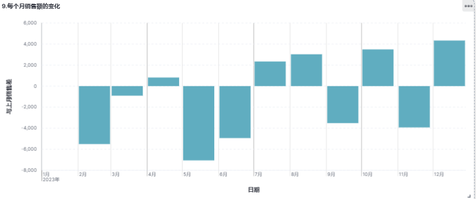

# 《实验五：kibana操作练习》

> **学院：  省级示范性软件学院**
>
> **课程：  高级数据库技术与应用**
>
> **题目：** 《实验五：kibana操作练习》
>
> **姓名：**  郭研棋
>
> **学号：**  2200770285
>
> **班级：**  软工2202
>
> **日期：**  2024-10-28
>
> **实验环境：**  Elasticsearch8.12.2   Kibana8.12.2

## 一、实验目的

1. 掌握kibana中可视化的基本操作以及复杂数据分析图表
2. 学习熟练仪表盘的制作

## 二、实验内容

（1）使用Kibana进行聚合操作

1. 统计每个产品类别的总销售额。

   

2. 计算每个产品类别的平均单价。

   

3. 找出销量最高的前5个产品。

   

4. 计算男性和女性客户的平均订单金额。

   

5. 计算每个年龄段（18-30，31-50，51+）的客户数量。

   

6. 找出订单数量最多的前5个城市。

   

7. 计算每个月的平均订单金额及每个月的总销售额。

   

8. 计算每天的订单数量，并显示7天移动平均值。

   

9. 每个月销售额的变化

   

10. 计算每个城市的平均订单金额。

    

（2）制作仪表盘

1. 产品数据仪表盘

   

2. 消费群体仪表盘

   

3. 销售时间仪表盘

   

## 三、问题及解决办法

问题：无法表示移动平均值等复杂情况

解决方法：采用自定义函数，对所需要的值进行函数定义
