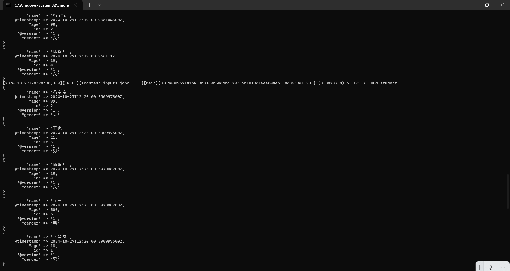
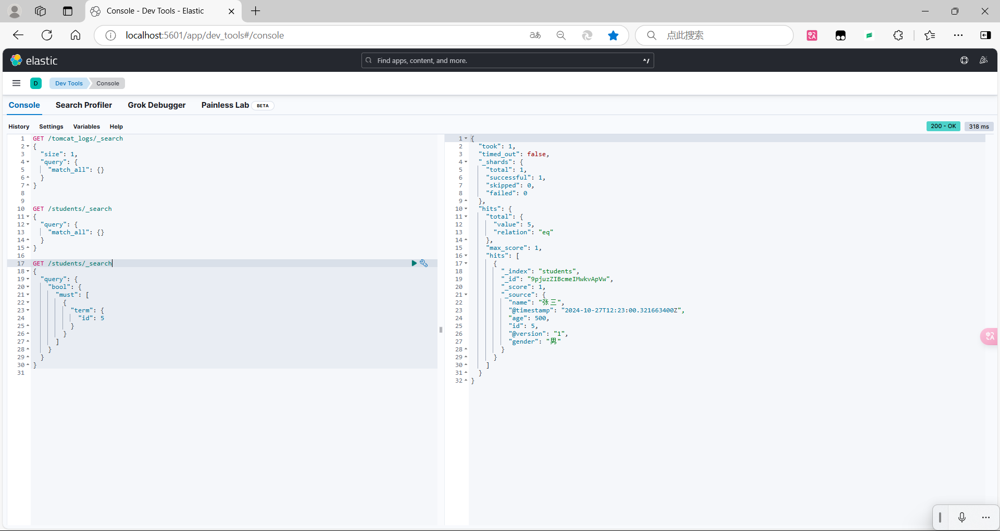

# 《实验四： Logstash 操作练习》

> **学院：  省级示范性软件学院**
>
> **课程：  高级数据库技术与应用**
>
> **题目：** 《实验四：Logstash 操作练习》
>
> **姓名：**  郭研棋
>
> **学号：**  2200770285
>
> **班级：**  软工2202
>
> **日期：**  2024-10-28
>
> **实验环境：**  Elasticsearch8.12.2   Kibana8.12.2

## 一、实验目的

学习使用Logstash ，能熟练应用进行数据传输、数据转换等与数据有关的操作

## 二、实验内容

### （一）tomcat日志处理

（1）将数据导入本地es，tomcat_logs索引中

```
input {
  file {
    path => "E:/AAAAAA学/学习/大三/高级数据库/tomcat_logs/localhost_access_log.*.txt"
    start_position => "beginning"
    sincedb_path => "F:/logstash-8.12.2/sincedb/sincedb"
  }
}

filter {
  grok {
    match => { "message" => "%{IPV6:client} - - \[%{HTTPDATE:timestamp}\] \"%{WORD:method} %{URIPATH:request} HTTP/%{NUMBER:http_version}\" %{NUMBER:response} (?:%{NUMBER:bytes}|-)" }
  }
  date {
    match => [ "timestamp", "dd/MMM/yyyy:HH:mm:ss Z" ]
    target => "@timestamp"
  }
}

output {
  elasticsearch {
    hosts => ["http://localhost:9200"]
    index => "tomcat_logs"
    template_name => "tomcat_template"
    manage_template => true
    template_overwrite => true
  }
  stdout { codec => rubydebug }
}
```

命令中提交成功


在es中查询，确定插入成功


（2）日志数据相关分析

1. 查询总请求数和前10个最常见的状态码

   ```
   GET /tomcat_logs/_search
   {
     "size": 0,
     "aggs": {
       "total_requests": {
         "value_count": {
           "field": "@timestamp"
         }
       },
       "status_codes": {
         "terms": {
           "field": "response.keyword",
           "size": 10
         }
       }
     }
   }
   ```

   查询成功结果

   

2. 查询每月的请求次数

   ```
   GET /tomcat_logs/_search
   {
     "size": 0,
     "aggs": {
       "requests_per_month": {
         "date_histogram": {
           "field": "@timestamp",
           "calendar_interval": "month"
         }
       }
     }
   }
   ```

   查询成功结果

   

3. 查询显示错误状态码, 以及每种错误下top 3的请求路径

   ```
   GET /tomcat_logs/_search
   {
     "size": 0,
     "query": {
       "range": {
         "response.keyword": {
           "gte": 400
         }
       }
     },
     "aggs": {
       "error_types": {
         "terms": {
           "field": "response.keyword"
         },
         "aggs": {
           "top_error_paths": {
             "terms": {
               "field": "request.keyword",
               "size": 3
             }
           }
         }
       }
     }
   }
   ```

   查询成功结果

   ```
   {
     "took": 3,
     "timed_out": false,
     "_shards": {
       "total": 1,
       "successful": 1,
       "skipped": 0,
       "failed": 0
     },
     "hits": {
       "total": {
         "value": 1519,
         "relation": "eq"
       },
       "max_score": null,
       "hits": []
     },
     "aggregations": {
       "error_types": {
         "doc_count_error_upper_bound": 0,
         "sum_other_doc_count": 0,
         "buckets": [
           {
             "key": "500",
             "doc_count": 781,
             "top_error_paths": {
               "doc_count_error_upper_bound": 0,
               "sum_other_doc_count": 654,
               "buckets": [
                 {
                   "key": "/static/js/app.js",
                   "doc_count": 48
                 },
                 {
                   "key": "/examples/jsp/images/execute.gif",
                   "doc_count": 41
                 },
                 {
                   "key": "/demo/hello",
                   "doc_count": 38
                 }
               ]
             }
           },
           {
             "key": "404",
             "doc_count": 738,
             "top_error_paths": {
               "doc_count_error_upper_bound": 0,
               "sum_other_doc_count": 627,
               "buckets": [
                 {
                   "key": "/demo1/",
                   "doc_count": 38
                 },
                 {
                   "key": "/blog/post/2",
                   "doc_count": 37
                 },
                 {
                   "key": "/demo",
                   "doc_count": 36
                 }
               ]
             }
           }
         ]
       }
     }
   }
   ```

4. 找出在错误请求中显著出现的请求地址

   ```
   GET /tomcat_logs/_search
   {
     "size": 0,
     "query": {
       "range": {
         "response.keyword": {
           "gte": 400
         }
       }
     },
     "aggs": {
       "suspicious_ips": {
         "significant_terms": {
           "field": "request.keyword",
           "size": 10
         }
       }
     }
   }
   ```

   查询成功结果

   ```
   {
     "took": 5,
     "timed_out": false,
     "_shards": {
       "total": 1,
       "successful": 1,
       "skipped": 0,
       "failed": 0
     },
     "hits": {
       "total": {
         "value": 1519,
         "relation": "eq"
       },
       "max_score": null,
       "hits": []
     },
     "aggregations": {
       "suspicious_ips": {
         "doc_count": 1519,
         "bg_count": 3000,
         "buckets": [
           {
             "key": "/static/js/app.js",
             "doc_count": 83,
             "score": 0.009797536335844318,
             "bg_count": 139
           },
           {
             "key": "/blog/post/2",
             "doc_count": 73,
             "score": 0.006498718563666251,
             "bg_count": 127
           },
           {
             "key": "/contact",
             "doc_count": 63,
             "score": 0.0046007105086720256,
             "bg_count": 112
           },
           {
             "key": "/products/item/123",
             "doc_count": 54,
             "score": 0.003943466150290308,
             "bg_count": 96
           },
           {
             "key": "/api/user/settings",
             "doc_count": 52,
             "score": 0.0035702286948652144,
             "bg_count": 93
           },
           {
             "key": "/api/data",
             "doc_count": 54,
             "score": 0.003536320068818568,
             "bg_count": 97
           },
           {
             "key": "/static/images/logo.png",
             "doc_count": 65,
             "score": 0.003370779449776955,
             "bg_count": 119
           },
           {
             "key": "/api/user/profile",
             "doc_count": 59,
             "score": 0.0026811320159876475,
             "bg_count": 109
           },
           {
             "key": "/blog/post/1",
             "doc_count": 63,
             "score": 0.002257895344949038,
             "bg_count": 118
           },
           {
             "key": "/demo",
             "doc_count": 60,
             "score": 0.001201824715881426,
             "bg_count": 115
           }
         ]
       }
     }
   }
   ```

5. 查询匹配返回的字节数及其次数

   ```
   GET /tomcat_logs/_search
   {
     "size": 0,
     "aggs": {
       "client_ip_counts": {
         "terms": {
           "field": "bytes.keyword"
         }
       }
     }
   }
   
   ```

   查询成功结果

   ```
   {
     "took": 1,
     "timed_out": false,
     "_shards": {
       "total": 1,
       "successful": 1,
       "skipped": 0,
       "failed": 0
     },
     "hits": {
       "total": {
         "value": 3000,
         "relation": "eq"
       },
       "max_score": null,
       "hits": []
     },
     "aggregations": {
       "client_ip_counts": {
         "doc_count_error_upper_bound": 0,
         "sum_other_doc_count": 0,
         "buckets": [
           {
             "key": "292",
             "doc_count": 447
           },
           {
             "key": "1242",
             "doc_count": 446
           },
           {
             "key": "99",
             "doc_count": 429
           },
           {
             "key": "1231",
             "doc_count": 427
           },
           {
             "key": "14",
             "doc_count": 425
           },
           {
             "key": "13",
             "doc_count": 421
           },
           {
             "key": "0",
             "doc_count": 405
           }
         ]
       }
     }
   }
   ```

### （二）数据转换和传输

（1）在mysql中新建数据库及表


（2）将mysql中的表提交至es中

```
input {
  jdbc {
    jdbc_driver_library => "F:/logstash-8.12.2/config/mysql-connector-j-9.1.0.jar"
    jdbc_driver_class => "com.mysql.cj.jdbc.Driver"
    jdbc_connection_string => "jdbc:mysql://localhost:3306/jdbc_demo1"
    jdbc_user => "root"
    jdbc_password => "123456"
    statement => "SELECT * FROM student"
    schedule => "* * * * *"
  }
}

output {
  elasticsearch {
    hosts => ["http://localhost:9200"]
    index => "students"
    template_overwrite => true
  }
  stdout { codec => rubydebug }
}
```

命令中提交成功


在es中查询，确定插入成功


（3）更新数据，验证数据能否自动同步到es中

在mysql中插入新数据


命令中已自动更新



在es中查询新插入的张三，确认已自动更新



## 三、问题及解决办法

1. 问题：tomcat日志导入本地es中时无法成功

   解决办法：设置模板，定义索引的映射。使Logstash自动管理索引模板并且覆盖现有模板

2. 问题：MySQL表格导入es中时显示模板冲突

   解决办法：用命令删除模板后再重启Logstash
